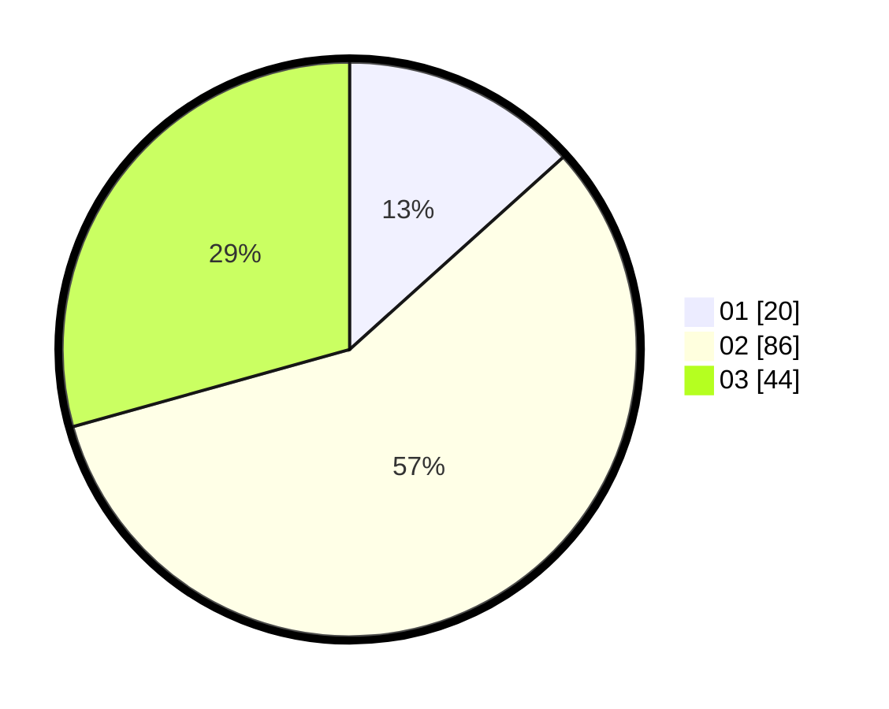

# Hasil

Hasil perolehan suara paslon dapat dilihat pada file paslon-01.txt, paslon-02.txt, dan paslon-03.txt.

Jika tidak ada, artinya data tersebut belum ada pada SIREKAP.

## Perolehan Suara

 * Paslon 01: **20**.
 * Paslon 02: **86**.
 * Paslon 03: **44**.

## Foto C Plano

https://sirekap-obj-formc.kpu.go.id/2ca4/pemilu/ppwp/31/75/01/10/04/3175011004052-20240216-153934--dcdf52fe-5598-42b4-a455-d82163fe9c4c.jpg

https://sirekap-obj-formc.kpu.go.id/2ca4/pemilu/ppwp/31/75/01/10/04/3175011004052-20240216-153935--a7104d63-9aff-4720-8c8b-0f9207619781.jpg

https://sirekap-obj-formc.kpu.go.id/2ca4/pemilu/ppwp/31/75/01/10/04/3175011004052-20240216-153934--b0bbd6a6-b56a-42bf-86b7-4073a0a9bdcc.jpg

## DATA PEMILIH TETAP

Jumlah pemilih dalam DPT: **0**.
 * L: **0**.
 * P: **0**.

## DATA PENGGUNA HAK PILIH

Jumlah pengguna hak pilih dalam DPT: **0**.
 * L: **0**.
 * P: **0**.

Jumlah pengguna hak pilih dalam DPTb: **0**.
 * L: **0**.
 * P: **0**.

Jumlah pengguna hak pilih dalam DPK: **0**.
 * L: **0**.
 * P: **0**.

Jumlah pengguna hak pilih: **0**.
 * L: **0**.
 * P: **0**.

## JUMLAH SUARA SAH DAN TIDAK SAH

JUMLAH SELURUH SUARA SAH: **180**.

JUMLAH SUARA TIDAK SAH: **3**.

JUMLAH SELURUH SUARA SAH DAN SUARA TIDAK SAH: **183**.
