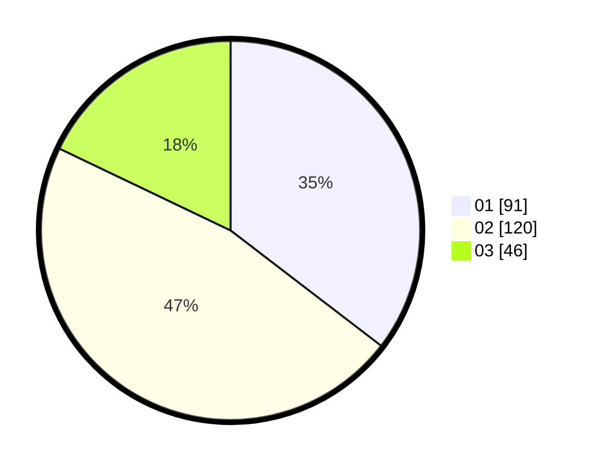

# Hasil

Hasil perolehan suara paslon dapat dilihat pada file paslon-01.txt, paslon-02.txt, dan paslon-03.txt.

Jika tidak ada, artinya data tersebut belum ada pada SIREKAP.

## Perolehan Suara

 * Paslon 01: **91**.
 * Paslon 02: **120**.
 * Paslon 03: **46**.

## Foto C Plano

https://sirekap-obj-formc.kpu.go.id/358d/pemilu/ppwp/31/75/01/10/04/3175011004061-20240215-104622--32252be0-e645-4e0e-8f80-c8c2f77dda14.jpg

https://sirekap-obj-formc.kpu.go.id/358d/pemilu/ppwp/31/75/01/10/04/3175011004061-20240215-104743--2eae21b7-dcbd-4e11-b5e0-8b173cb70dd5.jpg

https://sirekap-obj-formc.kpu.go.id/358d/pemilu/ppwp/31/75/01/10/04/3175011004061-20240215-104852--5be6f955-cd01-4fcb-993c-a836d349ff3b.jpg
