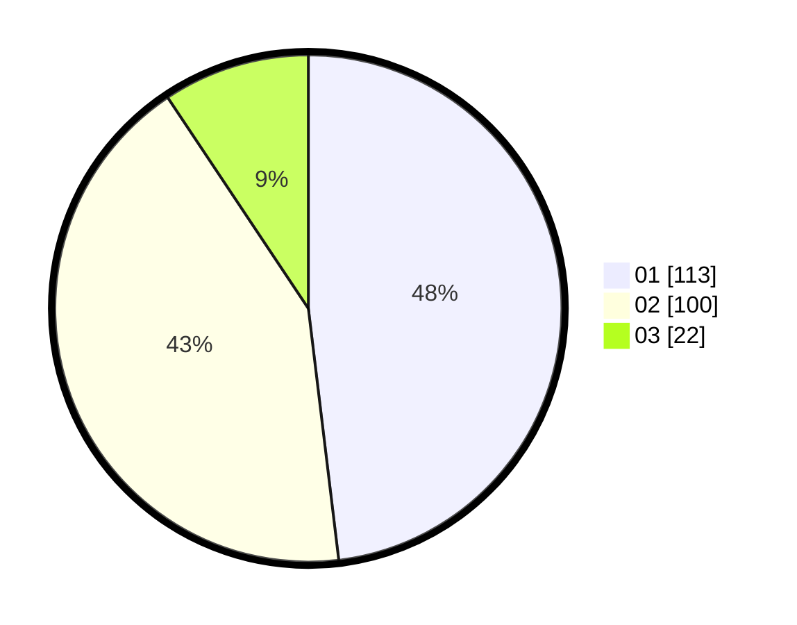

# Hasil

Hasil perolehan suara paslon dapat dilihat pada file paslon-01.txt, paslon-02.txt, dan paslon-03.txt.

Jika tidak ada, artinya data tersebut belum ada pada SIREKAP.

## Perolehan Suara

 * Paslon 01: **113**.
 * Paslon 02: **100**.
 * Paslon 03: **22**.

## Foto C Plano

https://sirekap-obj-formc.kpu.go.id/271e/pemilu/ppwp/31/75/01/10/04/3175011004062-20240214-201857--51d466bc-6856-4961-951f-088d0fe38416.jpg

https://sirekap-obj-formc.kpu.go.id/271e/pemilu/ppwp/31/75/01/10/04/3175011004062-20240214-202233--0a7565db-2a15-473a-b83d-af7c9d01c994.jpg

https://sirekap-obj-formc.kpu.go.id/271e/pemilu/ppwp/31/75/01/10/04/3175011004062-20240214-202441--5aee1436-ae66-4c14-98fd-46dac30c0153.jpg

## DATA PEMILIH TETAP

Jumlah pemilih dalam DPT: **293**.
 * L: **150**.
 * P: **143**.

## DATA PENGGUNA HAK PILIH

Jumlah pengguna hak pilih dalam DPT: **230**.
 * L: **112**.
 * P: **118**.

Jumlah pengguna hak pilih dalam DPTb: **9**.
 * L: **3**.
 * P: **6**.

Jumlah pengguna hak pilih dalam DPK: **2**.
 * L: **1**.
 * P: **1**.

Jumlah pengguna hak pilih: **241**.
 * L: **116**.
 * P: **125**.

## JUMLAH SUARA SAH DAN TIDAK SAH

JUMLAH SELURUH SUARA SAH: **235**.

JUMLAH SUARA TIDAK SAH: **6**.

JUMLAH SELURUH SUARA SAH DAN SUARA TIDAK SAH: **241**.
