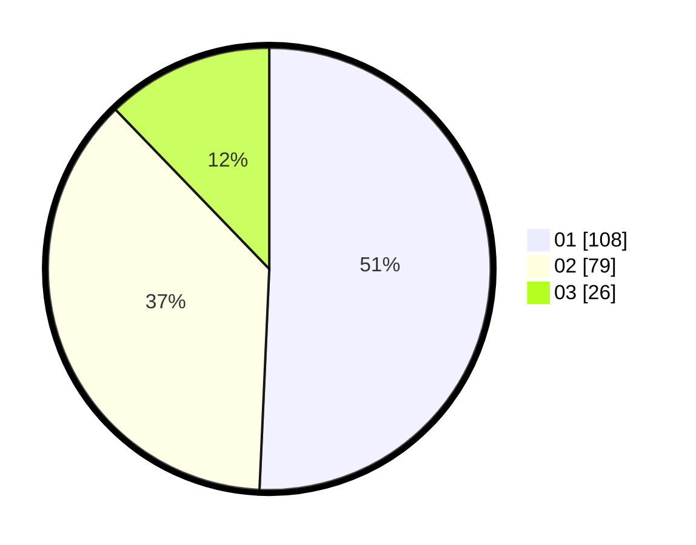

# Hasil

Hasil perolehan suara paslon dapat dilihat pada file paslon-01.txt, paslon-02.txt, dan paslon-03.txt.

Jika tidak ada, artinya data tersebut belum ada pada SIREKAP.

## Perolehan Suara

 * Paslon 01: **108**.
 * Paslon 02: **79**.
 * Paslon 03: **26**.

## Foto C Plano

https://sirekap-obj-formc.kpu.go.id/6e0f/pemilu/ppwp/31/75/01/10/05/3175011005001-20240214-192417--4c35e67c-5cde-4324-bb9b-c996aa431f4e.jpg

https://sirekap-obj-formc.kpu.go.id/6e0f/pemilu/ppwp/31/75/01/10/05/3175011005001-20240214-192434--808ef683-53ef-4c3e-a27d-0cde939283de.jpg

https://sirekap-obj-formc.kpu.go.id/6e0f/pemilu/ppwp/31/75/01/10/05/3175011005001-20240214-192450--07ae0021-ad38-4248-ab08-5b4ac479ce23.jpg

## DATA PEMILIH TETAP

Jumlah pemilih dalam DPT: **287**.
 * L: **148**.
 * P: **139**.

## DATA PENGGUNA HAK PILIH

Jumlah pengguna hak pilih dalam DPT: **212**.
 * L: **102**.
 * P: **110**.

Jumlah pengguna hak pilih dalam DPTb: **2**.
 * L: **0**.
 * P: **2**.

Jumlah pengguna hak pilih dalam DPK: **0**.
 * L: **0**.
 * P: **0**.

Jumlah pengguna hak pilih: **214**.
 * L: **102**.
 * P: **112**.

## JUMLAH SUARA SAH DAN TIDAK SAH

JUMLAH SELURUH SUARA SAH: **213**.

JUMLAH SUARA TIDAK SAH: **1**.

JUMLAH SELURUH SUARA SAH DAN SUARA TIDAK SAH: **214**.
