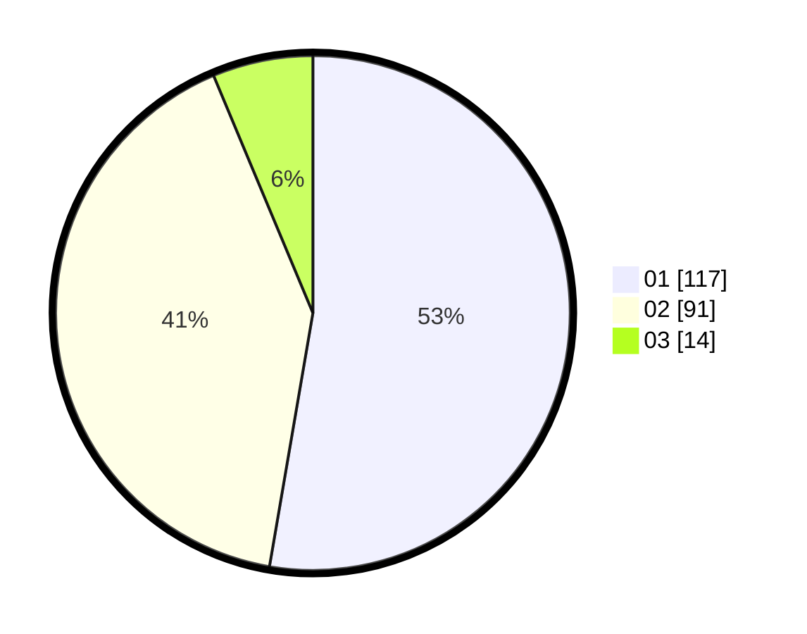

# Hasil

Hasil perolehan suara paslon dapat dilihat pada file paslon-01.txt, paslon-02.txt, dan paslon-03.txt.

Jika tidak ada, artinya data tersebut belum ada pada SIREKAP.

## Perolehan Suara

 * Paslon 01: **117**.
 * Paslon 02: **91**.
 * Paslon 03: **14**.

## Foto C Plano

https://sirekap-obj-formc.kpu.go.id/610e/pemilu/ppwp/31/75/01/10/05/3175011005004-20240214-190035--6fd05f17-5b98-4a55-9088-7d8541261dc6.jpg

https://sirekap-obj-formc.kpu.go.id/610e/pemilu/ppwp/31/75/01/10/05/3175011005004-20240214-155204--28a759be-8ec1-49d3-a765-6c5a3094d4aa.jpg

https://sirekap-obj-formc.kpu.go.id/610e/pemilu/ppwp/31/75/01/10/05/3175011005004-20240214-155320--fb5c0a66-770c-44c0-9b00-01509b0a74a6.jpg

## DATA PEMILIH TETAP

Jumlah pemilih dalam DPT: **278**.
 * L: **140**.
 * P: **138**.

## DATA PENGGUNA HAK PILIH

Jumlah pengguna hak pilih dalam DPT: **240**.
 * L: **124**.
 * P: **116**.

Jumlah pengguna hak pilih dalam DPTb: **1**.
 * L: **1**.
 * P: **0**.

Jumlah pengguna hak pilih dalam DPK: **3**.
 * L: **1**.
 * P: **2**.

Jumlah pengguna hak pilih: **244**.
 * L: **126**.
 * P: **118**.

## JUMLAH SUARA SAH DAN TIDAK SAH

JUMLAH SELURUH SUARA SAH: **222**.

JUMLAH SUARA TIDAK SAH: **4**.

JUMLAH SELURUH SUARA SAH DAN SUARA TIDAK SAH: **226**.
