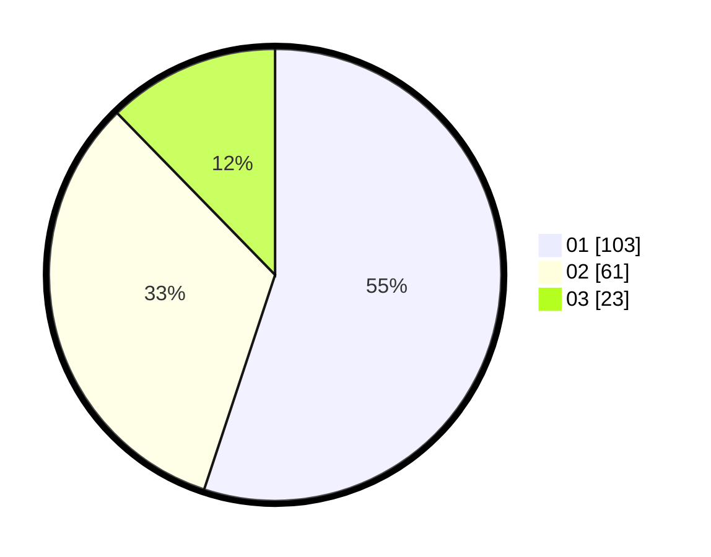

# Hasil

Hasil perolehan suara paslon dapat dilihat pada file paslon-01.txt, paslon-02.txt, dan paslon-03.txt.

Jika tidak ada, artinya data tersebut belum ada pada SIREKAP.

## Perolehan Suara

 * Paslon 01: **103**.
 * Paslon 02: **61**.
 * Paslon 03: **23**.

## Foto C Plano

https://sirekap-obj-formc.kpu.go.id/a0f5/pemilu/ppwp/31/75/01/10/05/3175011005007-20240214-191919--3033cad7-f39c-4a4c-814d-b7422c06c147.jpg

https://sirekap-obj-formc.kpu.go.id/a0f5/pemilu/ppwp/31/75/01/10/05/3175011005007-20240214-192117--d15d4df6-6009-4468-b42c-ac6ea4608f92.jpg

https://sirekap-obj-formc.kpu.go.id/a0f5/pemilu/ppwp/31/75/01/10/05/3175011005007-20240214-192223--f6c5ed18-6e5c-4fca-bff2-ec3478b649b7.jpg

## DATA PEMILIH TETAP

Jumlah pemilih dalam DPT: **261**.
 * L: **133**.
 * P: **128**.

## DATA PENGGUNA HAK PILIH

Jumlah pengguna hak pilih dalam DPT: **175**.
 * L: **83**.
 * P: **92**.

Jumlah pengguna hak pilih dalam DPTb: **8**.
 * L: **5**.
 * P: **3**.

Jumlah pengguna hak pilih dalam DPK: **2**.
 * L: **1**.
 * P: **1**.

Jumlah pengguna hak pilih: **185**.
 * L: **89**.
 * P: **96**.

## JUMLAH SUARA SAH DAN TIDAK SAH

JUMLAH SELURUH SUARA SAH: **187**.

JUMLAH SUARA TIDAK SAH: **4**.

JUMLAH SELURUH SUARA SAH DAN SUARA TIDAK SAH: **191**.
