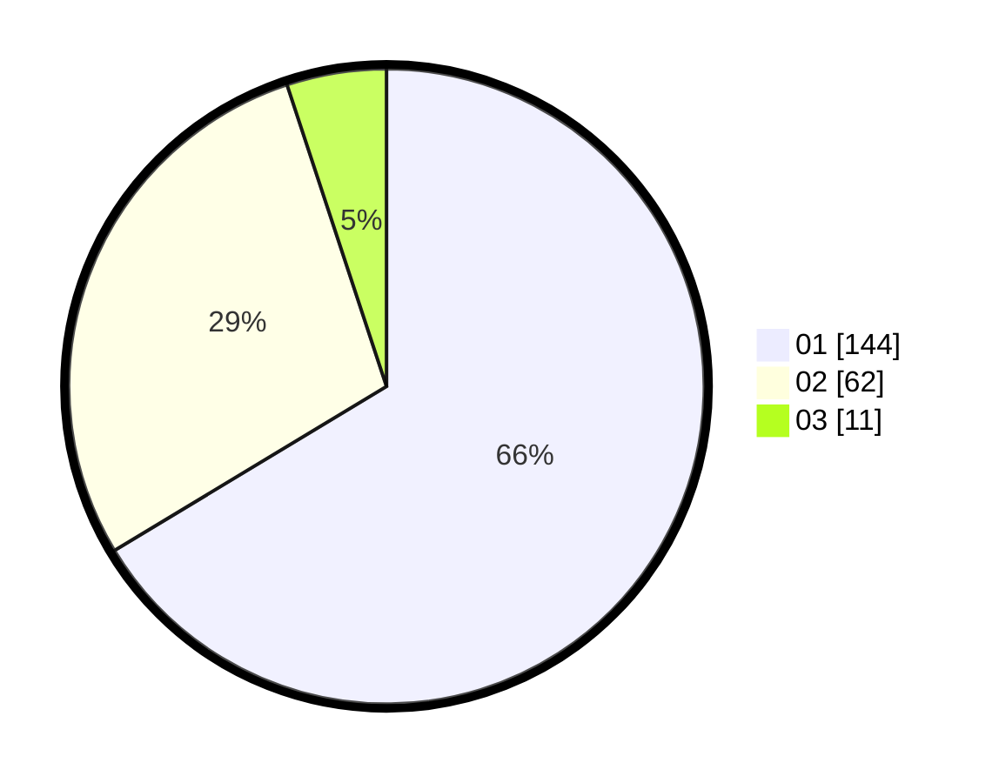

# Hasil

Hasil perolehan suara paslon dapat dilihat pada file paslon-01.txt, paslon-02.txt, dan paslon-03.txt.

Jika tidak ada, artinya data tersebut belum ada pada SIREKAP.

## Perolehan Suara

 * Paslon 01: **144**.
 * Paslon 02: **62**.
 * Paslon 03: **11**.

## Foto C Plano

https://sirekap-obj-formc.kpu.go.id/b0be/pemilu/ppwp/31/75/01/10/05/3175011005013-20240214-191008--ebcfe821-3d04-4c7b-9655-041157142ea8.jpg

https://sirekap-obj-formc.kpu.go.id/b0be/pemilu/ppwp/31/75/01/10/05/3175011005013-20240214-191225--07228503-9b05-46e3-a935-c30178b2f2aa.jpg

https://sirekap-obj-formc.kpu.go.id/b0be/pemilu/ppwp/31/75/01/10/05/3175011005013-20240214-211144--10154d05-e4f0-4c22-8ed3-45387eaa52d8.jpg

## DATA PEMILIH TETAP

Jumlah pemilih dalam DPT: **284**.
 * L: **147**.
 * P: **137**.

## DATA PENGGUNA HAK PILIH

Jumlah pengguna hak pilih dalam DPT: **216**.
 * L: **110**.
 * P: **106**.

Jumlah pengguna hak pilih dalam DPTb: **2**.
 * L: **1**.
 * P: **1**.

Jumlah pengguna hak pilih dalam DPK: **0**.
 * L: **0**.
 * P: **0**.

Jumlah pengguna hak pilih: **218**.
 * L: **111**.
 * P: **107**.

## JUMLAH SUARA SAH DAN TIDAK SAH

JUMLAH SELURUH SUARA SAH: **217**.

JUMLAH SUARA TIDAK SAH: **1**.

JUMLAH SELURUH SUARA SAH DAN SUARA TIDAK SAH: **218**.
