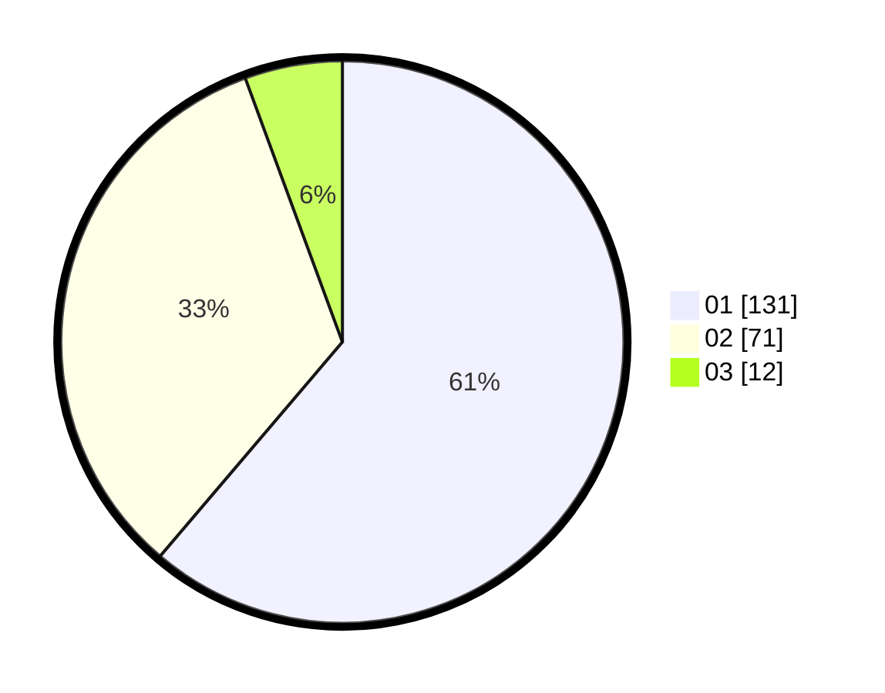

# Hasil

Hasil perolehan suara paslon dapat dilihat pada file paslon-01.txt, paslon-02.txt, dan paslon-03.txt.

Jika tidak ada, artinya data tersebut belum ada pada SIREKAP.

## Perolehan Suara

 * Paslon 01: **131**.
 * Paslon 02: **71**.
 * Paslon 03: **12**.

## Foto C Plano

https://sirekap-obj-formc.kpu.go.id/0b88/pemilu/ppwp/31/75/01/10/05/3175011005016-20240214-155151--ed0202bb-e0e7-4caf-aa15-d0dc2c74cc04.jpg

https://sirekap-obj-formc.kpu.go.id/0b88/pemilu/ppwp/31/75/01/10/05/3175011005016-20240214-155630--a2d50f28-ac84-4f59-8d8f-6f37a392279e.jpg

https://sirekap-obj-formc.kpu.go.id/0b88/pemilu/ppwp/31/75/01/10/05/3175011005016-20240214-155855--4990b551-63fe-4757-bfa9-fb0cbc5c2851.jpg
