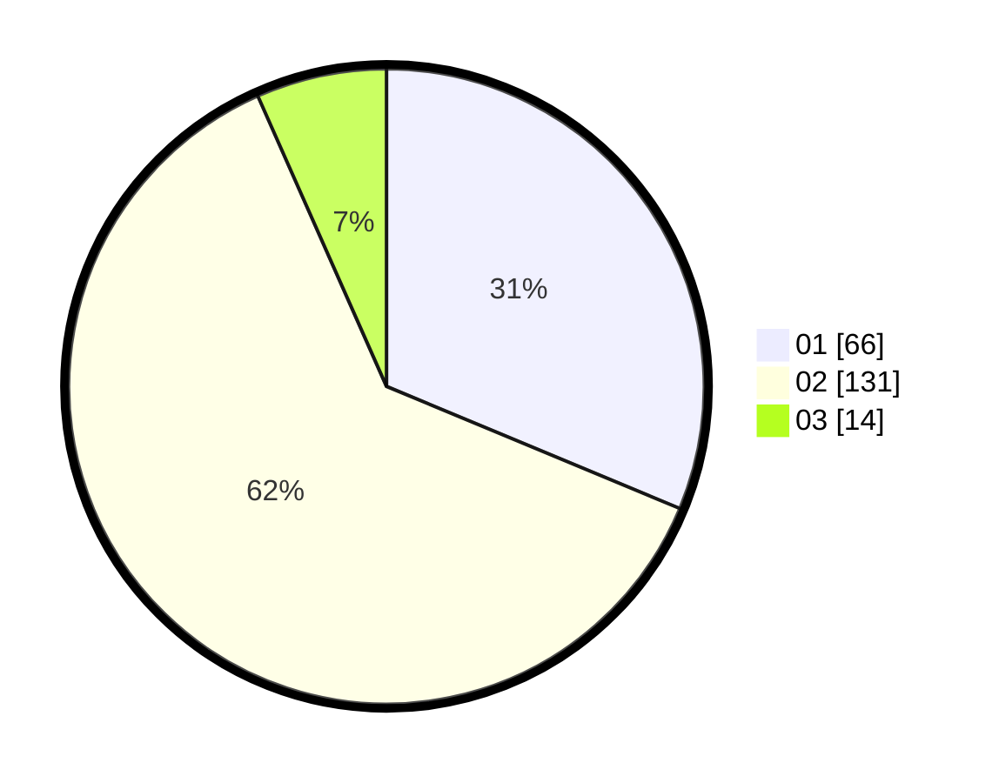

# Hasil

Hasil perolehan suara paslon dapat dilihat pada file paslon-01.txt, paslon-02.txt, dan paslon-03.txt.

Jika tidak ada, artinya data tersebut belum ada pada SIREKAP.

## Perolehan Suara

 * Paslon 01: **66**.
 * Paslon 02: **131**.
 * Paslon 03: **14**.

## Foto C Plano

https://sirekap-obj-formc.kpu.go.id/8665/pemilu/ppwp/31/75/01/10/05/3175011005017-20240214-231221--2df72da2-448f-40bd-ba06-4b8a2d0485ce.jpg

https://sirekap-obj-formc.kpu.go.id/8665/pemilu/ppwp/31/75/01/10/05/3175011005017-20240214-231328--485d9032-0d5f-46fe-9372-b63e7e383059.jpg

https://sirekap-obj-formc.kpu.go.id/8665/pemilu/ppwp/31/75/01/10/05/3175011005017-20240214-225356--36e8c237-4254-480d-9cd1-e3691e67a724.jpg
