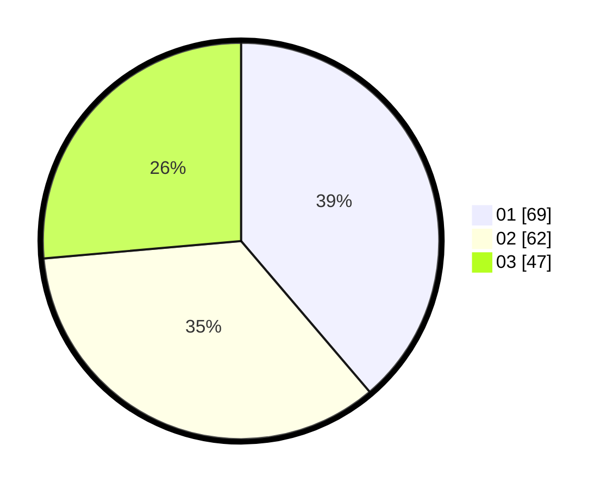

# Hasil

Hasil perolehan suara paslon dapat dilihat pada file paslon-01.txt, paslon-02.txt, dan paslon-03.txt.

Jika tidak ada, artinya data tersebut belum ada pada SIREKAP.

## Perolehan Suara

 * Paslon 01: **69**.
 * Paslon 02: **62**.
 * Paslon 03: **47**.

## Foto C Plano

https://sirekap-obj-formc.kpu.go.id/0c30/pemilu/ppwp/31/75/01/10/05/3175011005019-20240214-160105--5281e051-56a0-4320-9fed-b1651d1c53b0.jpg

https://sirekap-obj-formc.kpu.go.id/0c30/pemilu/ppwp/31/75/01/10/05/3175011005019-20240216-055710--c3512fa2-7f03-4cfc-893a-126b2457f36d.jpg

https://sirekap-obj-formc.kpu.go.id/0c30/pemilu/ppwp/31/75/01/10/05/3175011005019-20240216-055709--6e6e5431-1166-44be-9de4-19c2684e6c95.jpg

## DATA PEMILIH TETAP

Jumlah pemilih dalam DPT: **261**.
 * L: **120**.
 * P: **141**.

## DATA PENGGUNA HAK PILIH

Jumlah pengguna hak pilih dalam DPT: **179**.
 * L: **81**.
 * P: **98**.

Jumlah pengguna hak pilih dalam DPTb: **5**.
 * L: **0**.
 * P: **5**.

Jumlah pengguna hak pilih dalam DPK: **2**.
 * L: **1**.
 * P: **1**.

Jumlah pengguna hak pilih: **186**.
 * L: **82**.
 * P: **104**.

## JUMLAH SUARA SAH DAN TIDAK SAH

JUMLAH SELURUH SUARA SAH: **178**.

JUMLAH SUARA TIDAK SAH: **8**.

JUMLAH SELURUH SUARA SAH DAN SUARA TIDAK SAH: **186**.
