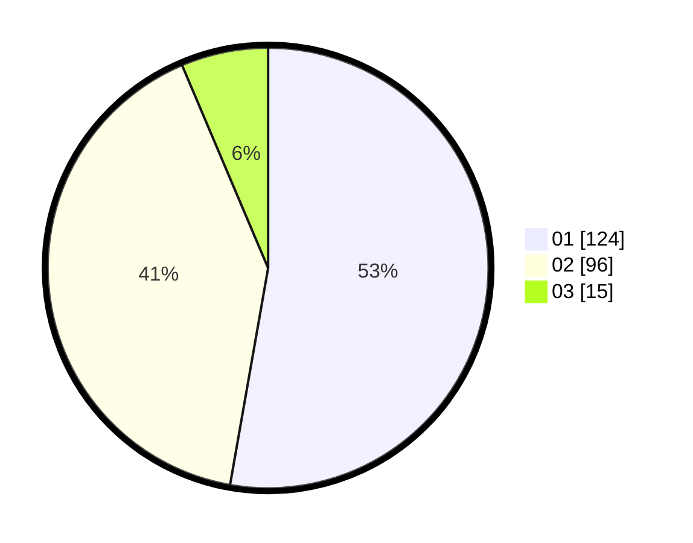

# Hasil

Hasil perolehan suara paslon dapat dilihat pada file paslon-01.txt, paslon-02.txt, dan paslon-03.txt.

Jika tidak ada, artinya data tersebut belum ada pada SIREKAP.

## Perolehan Suara

 * Paslon 01: **124**.
 * Paslon 02: **96**.
 * Paslon 03: **15**.

## Foto C Plano

https://sirekap-obj-formc.kpu.go.id/53e3/pemilu/ppwp/31/75/01/10/05/3175011005022-20240214-155539--b429aef8-f16a-44b3-a240-66d92d0d15e8.jpg

https://sirekap-obj-formc.kpu.go.id/53e3/pemilu/ppwp/31/75/01/10/05/3175011005022-20240214-155646--70c8011d-1351-4702-9be1-ad432dee4a4a.jpg

https://sirekap-obj-formc.kpu.go.id/53e3/pemilu/ppwp/31/75/01/10/05/3175011005022-20240214-155751--9e05860b-050f-4d2f-b73d-82fce470816d.jpg
