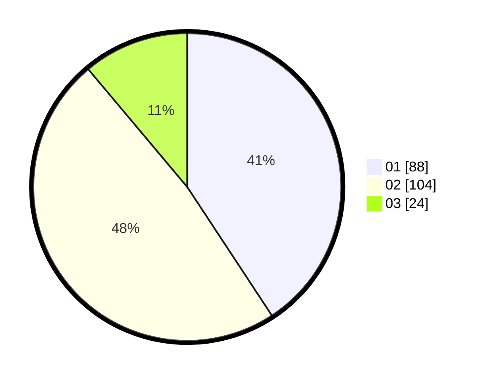

# Hasil

Hasil perolehan suara paslon dapat dilihat pada file paslon-01.txt, paslon-02.txt, dan paslon-03.txt.

Jika tidak ada, artinya data tersebut belum ada pada SIREKAP.

## Perolehan Suara

 * Paslon 01: **88**.
 * Paslon 02: **104**.
 * Paslon 03: **24**.

## Foto C Plano

https://sirekap-obj-formc.kpu.go.id/f210/pemilu/ppwp/31/75/01/10/05/3175011005030-20240214-223315--064681fd-12ce-49e6-9673-2d7e17eab6e7.jpg

https://sirekap-obj-formc.kpu.go.id/f210/pemilu/ppwp/31/75/01/10/05/3175011005030-20240214-223514--75403931-5a7c-4a33-b5c9-0aff4ffa2cc4.jpg

https://sirekap-obj-formc.kpu.go.id/f210/pemilu/ppwp/31/75/01/10/05/3175011005030-20240214-223646--132f16a3-53a9-441f-95e7-b68fbfb49514.jpg
