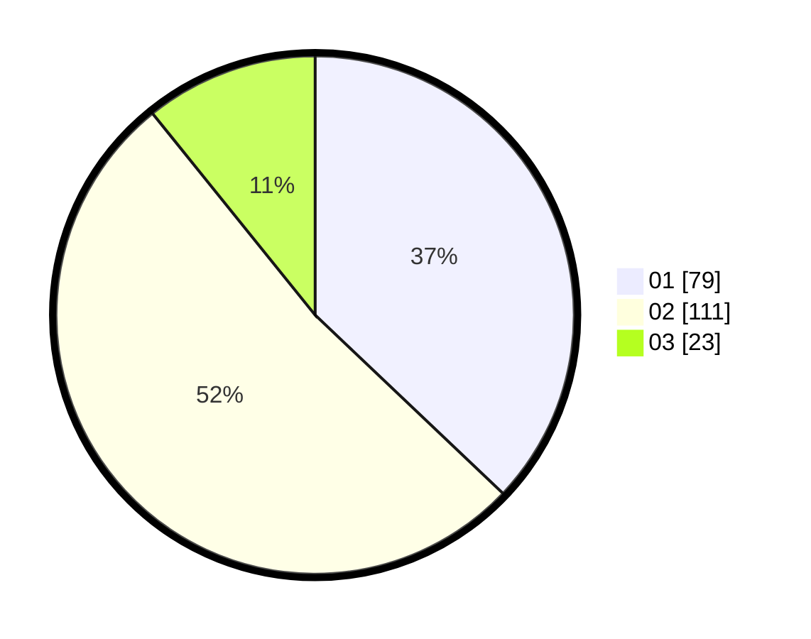

# Hasil

Hasil perolehan suara paslon dapat dilihat pada file paslon-01.txt, paslon-02.txt, dan paslon-03.txt.

Jika tidak ada, artinya data tersebut belum ada pada SIREKAP.

## Perolehan Suara

 * Paslon 01: **79**.
 * Paslon 02: **111**.
 * Paslon 03: **23**.

## Foto C Plano

https://sirekap-obj-formc.kpu.go.id/b833/pemilu/ppwp/31/75/01/10/05/3175011005033-20240214-230428--7a51c773-c746-427f-a0f1-1d2f6b505677.jpg

https://sirekap-obj-formc.kpu.go.id/b833/pemilu/ppwp/31/75/01/10/05/3175011005033-20240214-230003--ef732925-6604-473e-81c8-f6635f2e71ce.jpg

https://sirekap-obj-formc.kpu.go.id/b833/pemilu/ppwp/31/75/01/10/05/3175011005033-20240214-230123--c5a4bb36-fc94-4ed2-b4fd-b0210d011491.jpg
