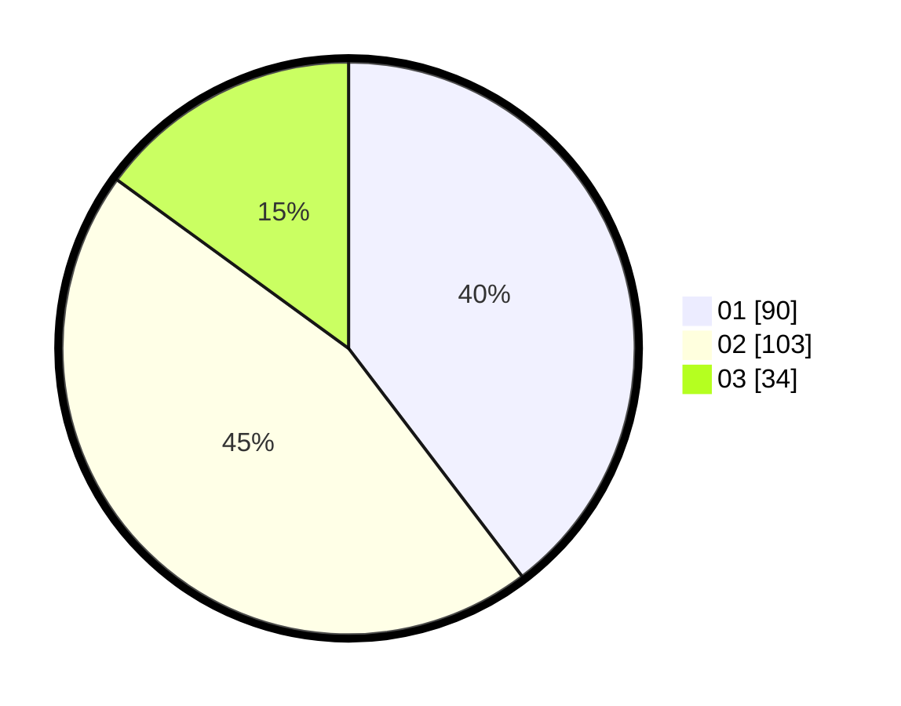

# Hasil

Hasil perolehan suara paslon dapat dilihat pada file paslon-01.txt, paslon-02.txt, dan paslon-03.txt.

Jika tidak ada, artinya data tersebut belum ada pada SIREKAP.

## Perolehan Suara

 * Paslon 01: **90**.
 * Paslon 02: **103**.
 * Paslon 03: **34**.

## Foto C Plano

https://sirekap-obj-formc.kpu.go.id/3850/pemilu/ppwp/31/75/01/10/05/3175011005034-20240214-215610--7ba45f0e-c141-4bc3-807d-5e2c0e1b8211.jpg

https://sirekap-obj-formc.kpu.go.id/3850/pemilu/ppwp/31/75/01/10/05/3175011005034-20240214-215801--61b39fee-781c-417b-a4b5-91abb40a2a6c.jpg

https://sirekap-obj-formc.kpu.go.id/3850/pemilu/ppwp/31/75/01/10/05/3175011005034-20240214-220237--3ef138e9-44f0-48e7-a4d7-5719e52d4b17.jpg
