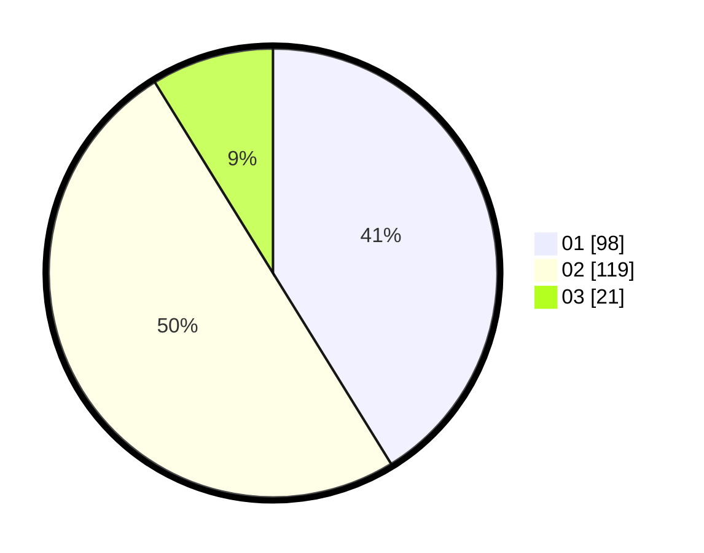

# Hasil

Hasil perolehan suara paslon dapat dilihat pada file paslon-01.txt, paslon-02.txt, dan paslon-03.txt.

Jika tidak ada, artinya data tersebut belum ada pada SIREKAP.

## Perolehan Suara

 * Paslon 01: **98**.
 * Paslon 02: **119**.
 * Paslon 03: **21**.

## Foto C Plano

https://sirekap-obj-formc.kpu.go.id/f493/pemilu/ppwp/31/75/01/10/05/3175011005035-20240214-220207--0fce0bdc-d0dc-495f-a990-be7802fe65c3.jpg

https://sirekap-obj-formc.kpu.go.id/f493/pemilu/ppwp/31/75/01/10/05/3175011005035-20240214-220334--6e599d96-8cc3-4774-93c7-647362b49318.jpg

https://sirekap-obj-formc.kpu.go.id/f493/pemilu/ppwp/31/75/01/10/05/3175011005035-20240214-220426--a3d77581-23be-4c66-a46c-8df465c70e81.jpg
