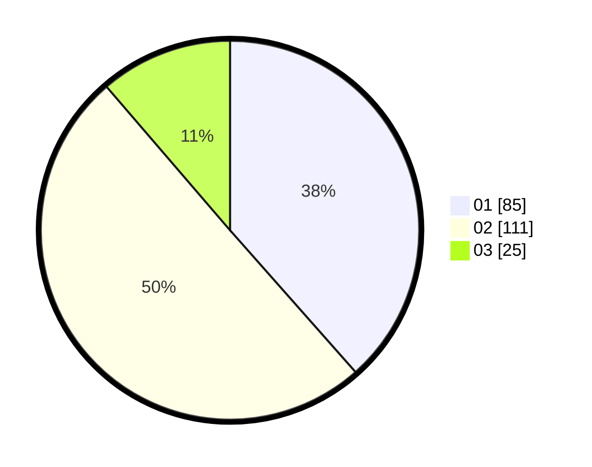

# Hasil

Hasil perolehan suara paslon dapat dilihat pada file paslon-01.txt, paslon-02.txt, dan paslon-03.txt.

Jika tidak ada, artinya data tersebut belum ada pada SIREKAP.

## Perolehan Suara

 * Paslon 01: **85**.
 * Paslon 02: **111**.
 * Paslon 03: **25**.

## Foto C Plano

https://sirekap-obj-formc.kpu.go.id/e3f8/pemilu/ppwp/31/75/01/10/05/3175011005038-20240214-230459--89106f0b-6456-488a-9665-b68bf910524f.jpg

https://sirekap-obj-formc.kpu.go.id/e3f8/pemilu/ppwp/31/75/01/10/05/3175011005038-20240214-155738--7dfcbef2-24ed-4737-be27-0c7fc107ba04.jpg

https://sirekap-obj-formc.kpu.go.id/e3f8/pemilu/ppwp/31/75/01/10/05/3175011005038-20240214-160105--18fa5237-55f2-4d96-a29f-7ccaf6d9f268.jpg
