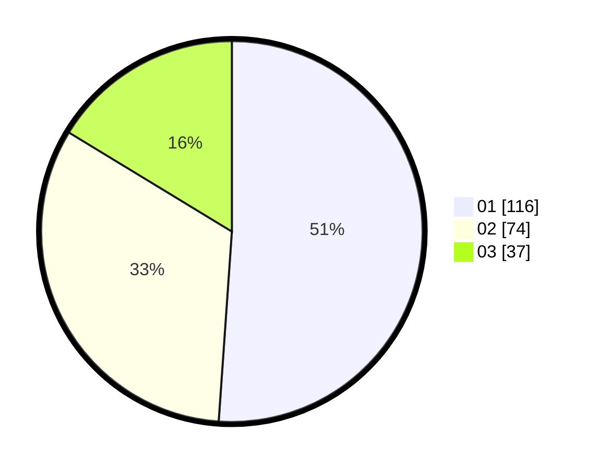

# Hasil

Hasil perolehan suara paslon dapat dilihat pada file paslon-01.txt, paslon-02.txt, dan paslon-03.txt.

Jika tidak ada, artinya data tersebut belum ada pada SIREKAP.

## Perolehan Suara

 * Paslon 01: **116**.
 * Paslon 02: **74**.
 * Paslon 03: **37**.

## Foto C Plano

https://sirekap-obj-formc.kpu.go.id/dc64/pemilu/ppwp/31/75/01/10/05/3175011005040-20240214-184632--604cf5ce-b7d0-456d-9e07-17c41a759c2c.jpg

https://sirekap-obj-formc.kpu.go.id/dc64/pemilu/ppwp/31/75/01/10/05/3175011005040-20240214-185442--9d571825-4de2-4fad-92c5-5dce15db37bf.jpg

https://sirekap-obj-formc.kpu.go.id/dc64/pemilu/ppwp/31/75/01/10/05/3175011005040-20240214-185515--71f537bb-28c1-4817-94f9-b64c306b2fec.jpg

## DATA PEMILIH TETAP

Jumlah pemilih dalam DPT: **276**.
 * L: **125**.
 * P: **151**.

## DATA PENGGUNA HAK PILIH

Jumlah pengguna hak pilih dalam DPT: **224**.
 * L: **99**.
 * P: **125**.

Jumlah pengguna hak pilih dalam DPTb: **2**.
 * L: **1**.
 * P: **1**.

Jumlah pengguna hak pilih dalam DPK: **4**.
 * L: **2**.
 * P: **2**.

Jumlah pengguna hak pilih: **230**.
 * L: **102**.
 * P: **128**.

## JUMLAH SUARA SAH DAN TIDAK SAH

JUMLAH SELURUH SUARA SAH: **227**.

JUMLAH SUARA TIDAK SAH: **3**.

JUMLAH SELURUH SUARA SAH DAN SUARA TIDAK SAH: **230**.
