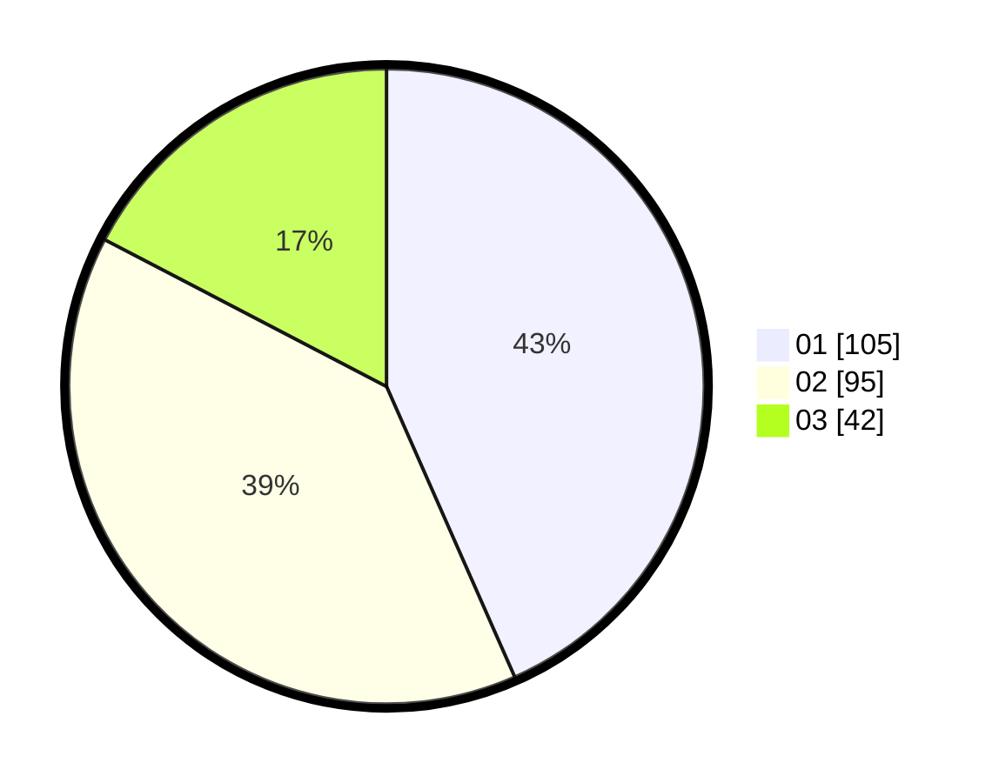

# Hasil

Hasil perolehan suara paslon dapat dilihat pada file paslon-01.txt, paslon-02.txt, dan paslon-03.txt.

Jika tidak ada, artinya data tersebut belum ada pada SIREKAP.

## Perolehan Suara

 * Paslon 01: **105**.
 * Paslon 02: **95**.
 * Paslon 03: **42**.

## Foto C Plano

https://sirekap-obj-formc.kpu.go.id/9a18/pemilu/ppwp/31/75/01/10/05/3175011005046-20240214-195054--e84f151b-55fd-446d-8763-fc0b4472344b.jpg

https://sirekap-obj-formc.kpu.go.id/9a18/pemilu/ppwp/31/75/01/10/05/3175011005046-20240214-202522--aae69467-96a6-4f85-9bc9-7a623b7e688d.jpg

https://sirekap-obj-formc.kpu.go.id/9a18/pemilu/ppwp/31/75/01/10/05/3175011005046-20240214-202602--5db84fb5-e34d-4baf-a615-272297b6a587.jpg
