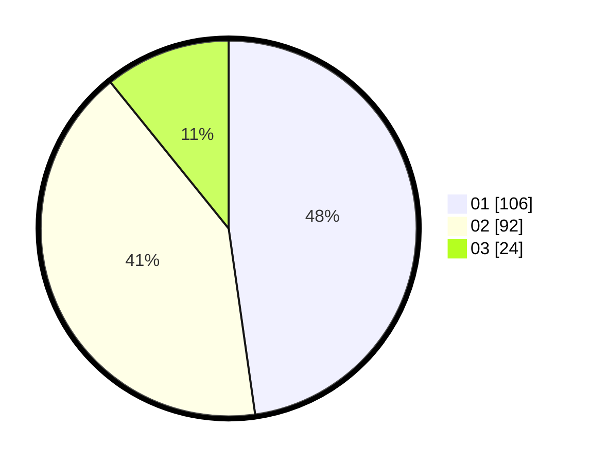

# Hasil

Hasil perolehan suara paslon dapat dilihat pada file paslon-01.txt, paslon-02.txt, dan paslon-03.txt.

Jika tidak ada, artinya data tersebut belum ada pada SIREKAP.

## Perolehan Suara

 * Paslon 01: **106**.
 * Paslon 02: **92**.
 * Paslon 03: **24**.

## Foto C Plano

https://sirekap-obj-formc.kpu.go.id/4aff/pemilu/ppwp/31/75/01/10/05/3175011005047-20240214-235728--4122b96d-00cc-49aa-95d1-28ecefab7580.jpg

https://sirekap-obj-formc.kpu.go.id/4aff/pemilu/ppwp/31/75/01/10/05/3175011005047-20240214-224019--00149d1f-ba61-417f-86ce-06ed92e01b8d.jpg

https://sirekap-obj-formc.kpu.go.id/4aff/pemilu/ppwp/31/75/01/10/05/3175011005047-20240214-224416--ad86c9d1-2e8c-4097-b676-73208d81c34d.jpg
