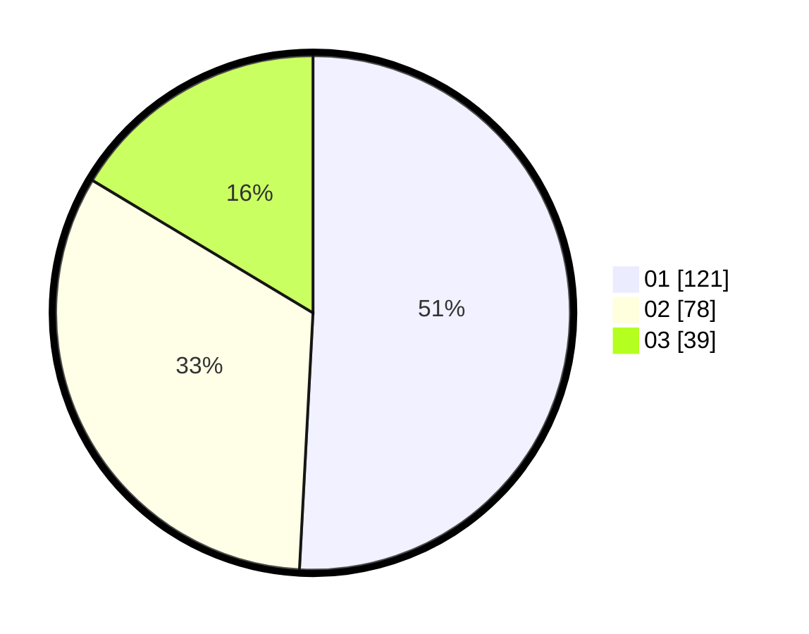

# Hasil

Hasil perolehan suara paslon dapat dilihat pada file paslon-01.txt, paslon-02.txt, dan paslon-03.txt.

Jika tidak ada, artinya data tersebut belum ada pada SIREKAP.

## Perolehan Suara

 * Paslon 01: **121**.
 * Paslon 02: **78**.
 * Paslon 03: **39**.

## Foto C Plano

https://sirekap-obj-formc.kpu.go.id/42f0/pemilu/ppwp/31/75/01/10/06/3175011006002-20240215-010930--0006b515-1698-4fe1-82bb-72d044f8441a.jpg

https://sirekap-obj-formc.kpu.go.id/42f0/pemilu/ppwp/31/75/01/10/06/3175011006002-20240215-011014--cbe5559a-fd1a-4d15-9264-c1aab8c63cd1.jpg

https://sirekap-obj-formc.kpu.go.id/42f0/pemilu/ppwp/31/75/01/10/06/3175011006002-20240215-011108--b18c143d-79cb-4b01-b7e3-adc29f3d3b3f.jpg

## DATA PEMILIH TETAP

Jumlah pemilih dalam DPT: **281**.
 * L: **124**.
 * P: **157**.

## DATA PENGGUNA HAK PILIH

Jumlah pengguna hak pilih dalam DPT: **235**.
 * L: **99**.
 * P: **136**.

Jumlah pengguna hak pilih dalam DPTb: **0**.
 * L: **0**.
 * P: **0**.

Jumlah pengguna hak pilih dalam DPK: **4**.
 * L: **4**.
 * P: **0**.

Jumlah pengguna hak pilih: **239**.
 * L: **103**.
 * P: **136**.

## JUMLAH SUARA SAH DAN TIDAK SAH

JUMLAH SELURUH SUARA SAH: **238**.

JUMLAH SUARA TIDAK SAH: **1**.

JUMLAH SELURUH SUARA SAH DAN SUARA TIDAK SAH: **239**.
