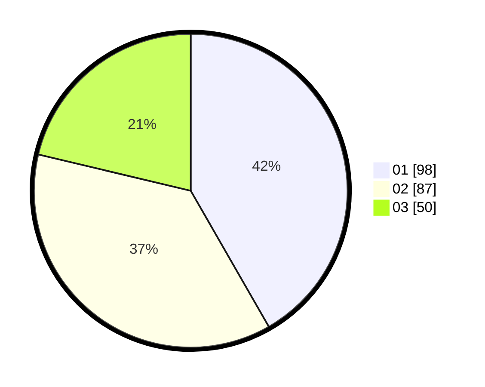

# Hasil

Hasil perolehan suara paslon dapat dilihat pada file paslon-01.txt, paslon-02.txt, dan paslon-03.txt.

Jika tidak ada, artinya data tersebut belum ada pada SIREKAP.

## Perolehan Suara

 * Paslon 01: **98**.
 * Paslon 02: **87**.
 * Paslon 03: **50**.

## Foto C Plano

https://sirekap-obj-formc.kpu.go.id/7e31/pemilu/ppwp/31/75/01/10/06/3175011006004-20240214-155746--dcc2f4ac-234e-41e2-9656-b7f066cb76af.jpg

https://sirekap-obj-formc.kpu.go.id/7e31/pemilu/ppwp/31/75/01/10/06/3175011006004-20240214-155850--80ffd99c-ca4c-4b05-9cda-bae0ed6d19ed.jpg

https://sirekap-obj-formc.kpu.go.id/7e31/pemilu/ppwp/31/75/01/10/06/3175011006004-20240214-160101--1e45bd31-cd17-40ce-bf44-f6b391ad2bdc.jpg
