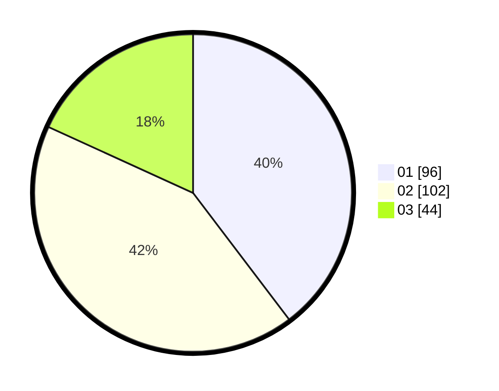

# Hasil

Hasil perolehan suara paslon dapat dilihat pada file paslon-01.txt, paslon-02.txt, dan paslon-03.txt.

Jika tidak ada, artinya data tersebut belum ada pada SIREKAP.

## Perolehan Suara

 * Paslon 01: **96**.
 * Paslon 02: **102**.
 * Paslon 03: **44**.

## Foto C Plano

https://sirekap-obj-formc.kpu.go.id/b7f3/pemilu/ppwp/31/75/01/10/06/3175011006005-20240215-023302--aac47a6d-43e8-4cc6-85dd-b9c74f23aea2.jpg

https://sirekap-obj-formc.kpu.go.id/b7f3/pemilu/ppwp/31/75/01/10/06/3175011006005-20240215-023307--f77b9527-fd93-4c04-aa5f-d0039ffa6255.jpg

https://sirekap-obj-formc.kpu.go.id/b7f3/pemilu/ppwp/31/75/01/10/06/3175011006005-20240215-023310--a654df44-04ea-4c83-b070-437d3e5efc08.jpg
