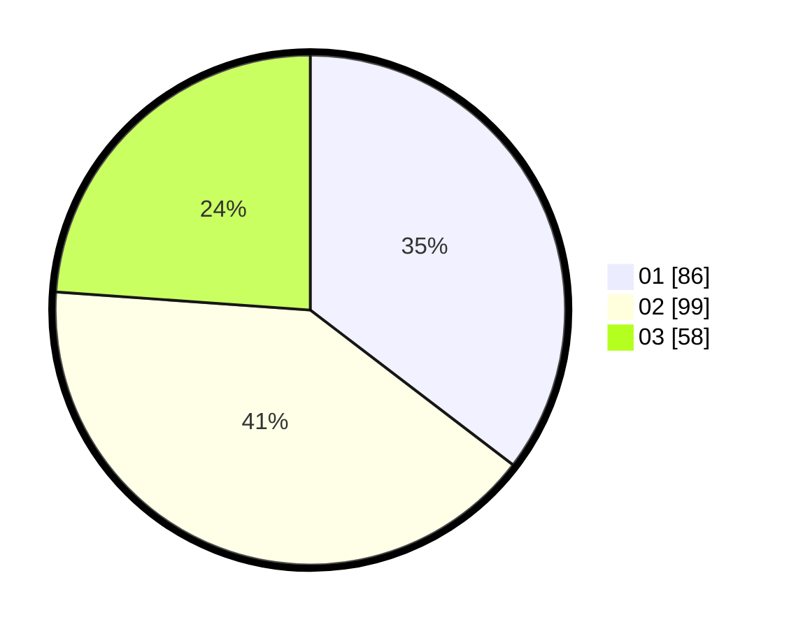

# Hasil

Hasil perolehan suara paslon dapat dilihat pada file paslon-01.txt, paslon-02.txt, dan paslon-03.txt.

Jika tidak ada, artinya data tersebut belum ada pada SIREKAP.

## Perolehan Suara

 * Paslon 01: **86**.
 * Paslon 02: **99**.
 * Paslon 03: **58**.

## Foto C Plano

https://sirekap-obj-formc.kpu.go.id/52e8/pemilu/ppwp/31/75/01/10/06/3175011006014-20240215-013638--1c3a7eaf-26db-43cb-85b6-69951f4fbce2.jpg

https://sirekap-obj-formc.kpu.go.id/52e8/pemilu/ppwp/31/75/01/10/06/3175011006014-20240214-233544--8b105452-1ea0-445a-80c2-e23882285030.jpg

https://sirekap-obj-formc.kpu.go.id/52e8/pemilu/ppwp/31/75/01/10/06/3175011006014-20240215-013752--dba793f4-9959-4090-9c50-499948859631.jpg
