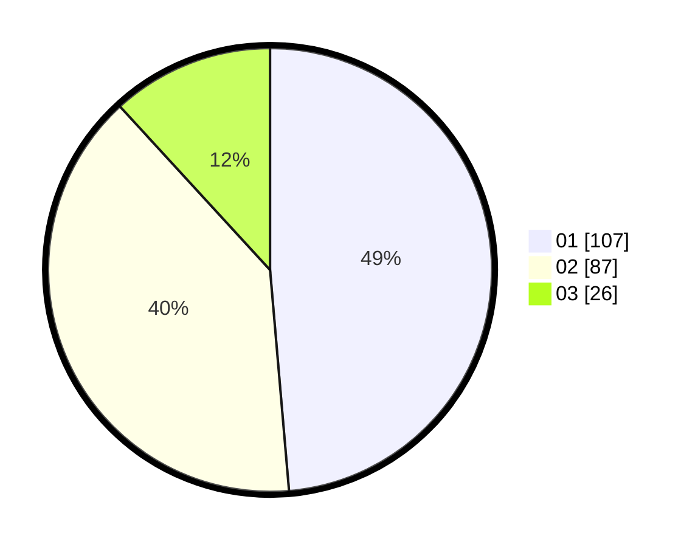

# Hasil

Hasil perolehan suara paslon dapat dilihat pada file paslon-01.txt, paslon-02.txt, dan paslon-03.txt.

Jika tidak ada, artinya data tersebut belum ada pada SIREKAP.

## Perolehan Suara

 * Paslon 01: **107**.
 * Paslon 02: **87**.
 * Paslon 03: **26**.

## Foto C Plano

https://sirekap-obj-formc.kpu.go.id/ae75/pemilu/ppwp/31/75/01/10/06/3175011006016-20240215-024017--14181728-ed51-48f9-bf87-931c40cfa270.jpg

https://sirekap-obj-formc.kpu.go.id/ae75/pemilu/ppwp/31/75/01/10/06/3175011006016-20240215-024137--df1cc35a-7da4-4fea-b1f8-fafe42b56758.jpg

https://sirekap-obj-formc.kpu.go.id/ae75/pemilu/ppwp/31/75/01/10/06/3175011006016-20240215-024236--8dbf52ff-95a2-4fc8-bed1-4fad2a24d7b8.jpg

## DATA PEMILIH TETAP

Jumlah pemilih dalam DPT: **269**.
 * L: **133**.
 * P: **136**.

## DATA PENGGUNA HAK PILIH

Jumlah pengguna hak pilih dalam DPT: **216**.
 * L: **107**.
 * P: **109**.

Jumlah pengguna hak pilih dalam DPTb: **6**.
 * L: **2**.
 * P: **4**.

Jumlah pengguna hak pilih dalam DPK: **1**.
 * L: **0**.
 * P: **1**.

Jumlah pengguna hak pilih: **223**.
 * L: **109**.
 * P: **114**.

## JUMLAH SUARA SAH DAN TIDAK SAH

JUMLAH SELURUH SUARA SAH: **220**.

JUMLAH SUARA TIDAK SAH: **3**.

JUMLAH SELURUH SUARA SAH DAN SUARA TIDAK SAH: **223**.
