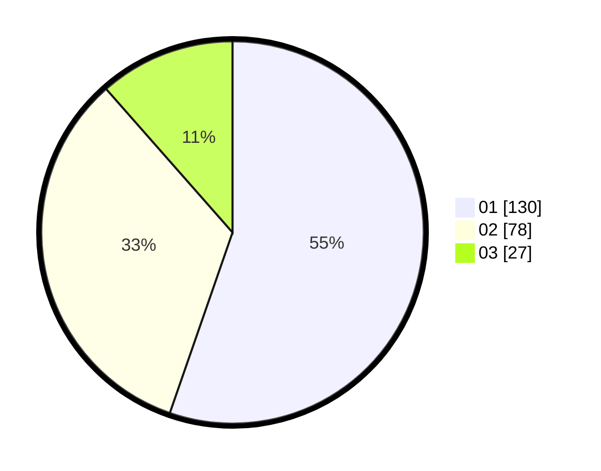

# Hasil

Hasil perolehan suara paslon dapat dilihat pada file paslon-01.txt, paslon-02.txt, dan paslon-03.txt.

Jika tidak ada, artinya data tersebut belum ada pada SIREKAP.

## Perolehan Suara

 * Paslon 01: **130**.
 * Paslon 02: **78**.
 * Paslon 03: **27**.

## Foto C Plano

https://sirekap-obj-formc.kpu.go.id/c8b0/pemilu/ppwp/31/75/01/10/06/3175011006019-20240214-185542--363d1eba-4594-4113-8a11-1f05ce746a21.jpg

https://sirekap-obj-formc.kpu.go.id/c8b0/pemilu/ppwp/31/75/01/10/06/3175011006019-20240214-185652--c3cf705d-7669-463b-ae0f-fb7f855771bd.jpg

https://sirekap-obj-formc.kpu.go.id/c8b0/pemilu/ppwp/31/75/01/10/06/3175011006019-20240214-185110--ed973ae0-5a02-4a4d-9b46-32c701e92786.jpg

## DATA PEMILIH TETAP

Jumlah pemilih dalam DPT: **271**.
 * L: **124**.
 * P: **147**.

## DATA PENGGUNA HAK PILIH

Jumlah pengguna hak pilih dalam DPT: **235**.
 * L: **102**.
 * P: **133**.

Jumlah pengguna hak pilih dalam DPTb: **4**.
 * L: **2**.
 * P: **2**.

Jumlah pengguna hak pilih dalam DPK: **0**.
 * L: **0**.
 * P: **0**.

Jumlah pengguna hak pilih: **239**.
 * L: **104**.
 * P: **135**.

## JUMLAH SUARA SAH DAN TIDAK SAH

JUMLAH SELURUH SUARA SAH: **235**.

JUMLAH SUARA TIDAK SAH: **4**.

JUMLAH SELURUH SUARA SAH DAN SUARA TIDAK SAH: **239**.
