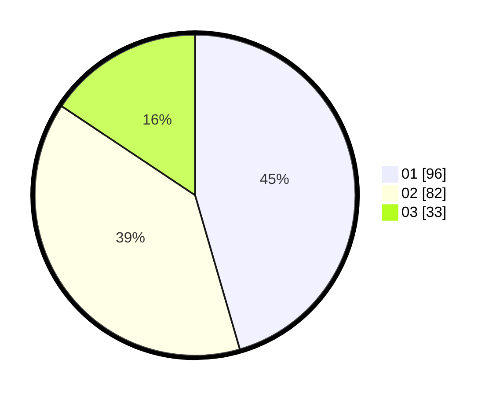

# Hasil

Hasil perolehan suara paslon dapat dilihat pada file paslon-01.txt, paslon-02.txt, dan paslon-03.txt.

Jika tidak ada, artinya data tersebut belum ada pada SIREKAP.

## Perolehan Suara

 * Paslon 01: **96**.
 * Paslon 02: **82**.
 * Paslon 03: **33**.

## Foto C Plano

https://sirekap-obj-formc.kpu.go.id/16ad/pemilu/ppwp/31/75/01/10/06/3175011006020-20240214-195235--eab1fa04-4089-4bf7-bf25-d85ca0468fdf.jpg

https://sirekap-obj-formc.kpu.go.id/16ad/pemilu/ppwp/31/75/01/10/06/3175011006020-20240214-195603--da4bd9be-ec2a-4ebc-9daa-2651163ddd89.jpg

https://sirekap-obj-formc.kpu.go.id/16ad/pemilu/ppwp/31/75/01/10/06/3175011006020-20240214-195752--c790bf6e-507f-4139-a53e-c45bb21a8dbd.jpg
