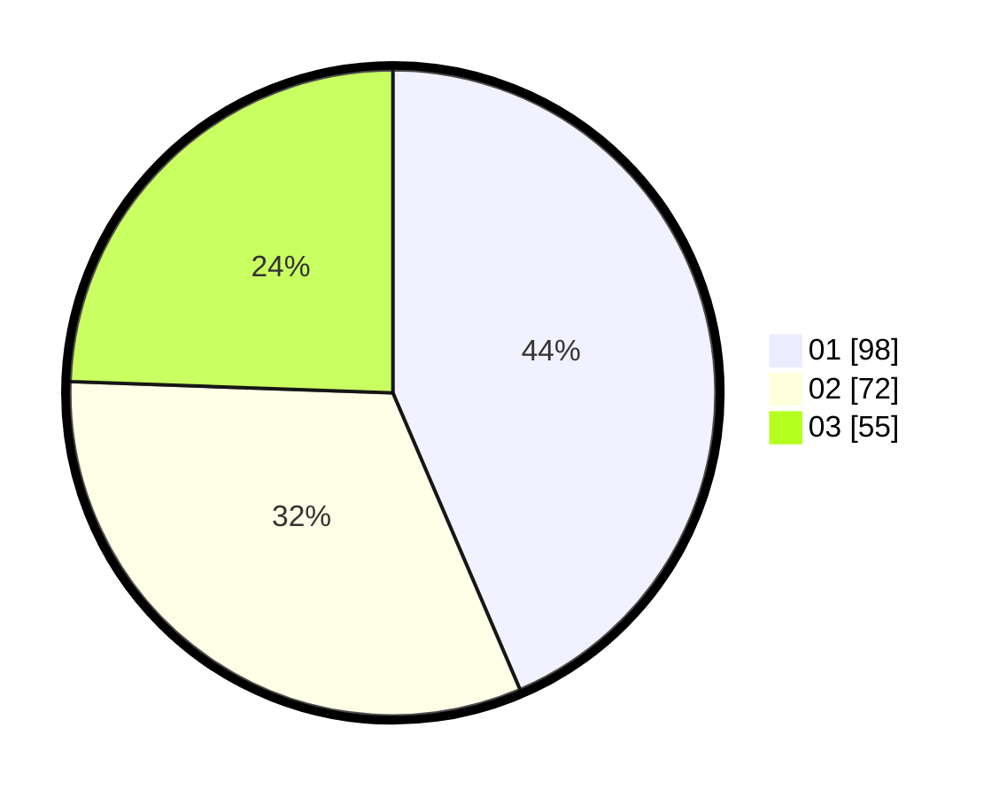

# Hasil

Hasil perolehan suara paslon dapat dilihat pada file paslon-01.txt, paslon-02.txt, dan paslon-03.txt.

Jika tidak ada, artinya data tersebut belum ada pada SIREKAP.

## Perolehan Suara

 * Paslon 01: **98**.
 * Paslon 02: **72**.
 * Paslon 03: **55**.

## Foto C Plano

https://sirekap-obj-formc.kpu.go.id/2b0e/pemilu/ppwp/31/75/01/10/06/3175011006024-20240214-222715--c62dafc1-f295-4fce-b6c4-267c0ab01ca8.jpg

https://sirekap-obj-formc.kpu.go.id/2b0e/pemilu/ppwp/31/75/01/10/06/3175011006024-20240214-222818--eb5cddb6-e8dd-462e-b6be-d45bff9ff163.jpg

https://sirekap-obj-formc.kpu.go.id/2b0e/pemilu/ppwp/31/75/01/10/06/3175011006024-20240214-222940--7c4983c3-4749-43c7-8c04-752a97975a39.jpg

## DATA PEMILIH TETAP

Jumlah pemilih dalam DPT: **292**.
 * L: **138**.
 * P: **154**.

## DATA PENGGUNA HAK PILIH

Jumlah pengguna hak pilih dalam DPT: **239**.
 * L: **108**.
 * P: **131**.

Jumlah pengguna hak pilih dalam DPTb: **6**.
 * L: **3**.
 * P: **3**.

Jumlah pengguna hak pilih dalam DPK: **1**.
 * L: **0**.
 * P: **1**.

Jumlah pengguna hak pilih: **246**.
 * L: **111**.
 * P: **135**.

## JUMLAH SUARA SAH DAN TIDAK SAH

JUMLAH SELURUH SUARA SAH: **225**.

JUMLAH SUARA TIDAK SAH: **21**.

JUMLAH SELURUH SUARA SAH DAN SUARA TIDAK SAH: **246**.
