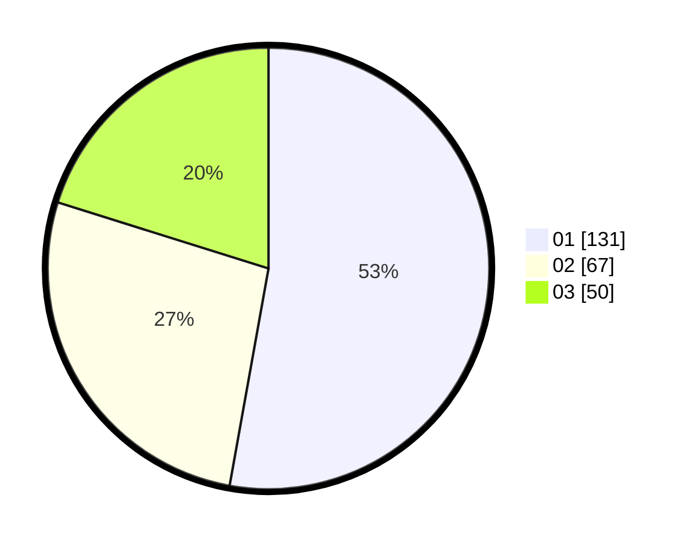

# Hasil

Hasil perolehan suara paslon dapat dilihat pada file paslon-01.txt, paslon-02.txt, dan paslon-03.txt.

Jika tidak ada, artinya data tersebut belum ada pada SIREKAP.

## Perolehan Suara

 * Paslon 01: **131**.
 * Paslon 02: **67**.
 * Paslon 03: **50**.

## Foto C Plano

https://sirekap-obj-formc.kpu.go.id/7cb7/pemilu/ppwp/31/75/01/10/06/3175011006025-20240215-041501--ce593d7c-ce1d-483d-a14c-7d60ee9c2b41.jpg

https://sirekap-obj-formc.kpu.go.id/7cb7/pemilu/ppwp/31/75/01/10/06/3175011006025-20240215-041527--d7059bd5-0e55-45b1-becc-0f07b9df0b90.jpg

https://sirekap-obj-formc.kpu.go.id/7cb7/pemilu/ppwp/31/75/01/10/06/3175011006025-20240215-234516--09855556-ef16-46aa-a849-1e9bbb41b736.jpg

## DATA PEMILIH TETAP

Jumlah pemilih dalam DPT: **289**.
 * L: **142**.
 * P: **147**.

## DATA PENGGUNA HAK PILIH

Jumlah pengguna hak pilih dalam DPT: **250**.
 * L: **120**.
 * P: **130**.

Jumlah pengguna hak pilih dalam DPTb: **5**.
 * L: **3**.
 * P: **2**.

Jumlah pengguna hak pilih dalam DPK: **0**.
 * L: **0**.
 * P: **0**.

Jumlah pengguna hak pilih: **250**.
 * L: **120**.
 * P: **130**.

## JUMLAH SUARA SAH DAN TIDAK SAH

JUMLAH SELURUH SUARA SAH: **248**.

JUMLAH SUARA TIDAK SAH: **2**.

JUMLAH SELURUH SUARA SAH DAN SUARA TIDAK SAH: **250**.
