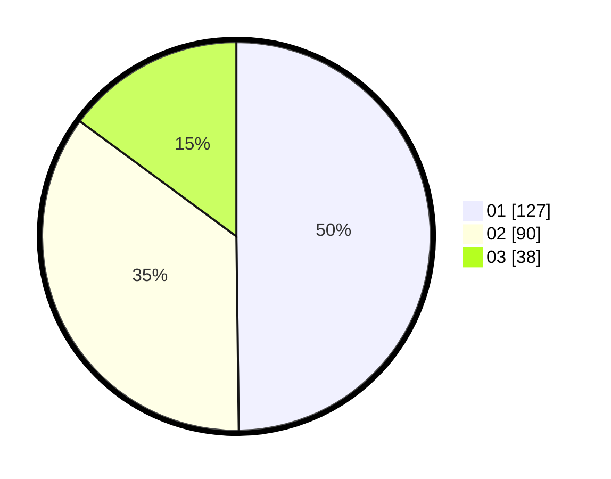

# Hasil

Hasil perolehan suara paslon dapat dilihat pada file paslon-01.txt, paslon-02.txt, dan paslon-03.txt.

Jika tidak ada, artinya data tersebut belum ada pada SIREKAP.

## Perolehan Suara

 * Paslon 01: **127**.
 * Paslon 02: **90**.
 * Paslon 03: **38**.

## Foto C Plano

https://sirekap-obj-formc.kpu.go.id/1be5/pemilu/ppwp/31/75/01/10/06/3175011006028-20240215-002230--ee7d8d59-51c2-46c6-9677-5cc851c38393.jpg

https://sirekap-obj-formc.kpu.go.id/1be5/pemilu/ppwp/31/75/01/10/06/3175011006028-20240215-002550--f5d6e961-ecd3-44d3-b92b-6bd7599d8bc2.jpg

https://sirekap-obj-formc.kpu.go.id/1be5/pemilu/ppwp/31/75/01/10/06/3175011006028-20240215-002822--1b152416-9e53-402f-8d02-3572cb44debe.jpg

## DATA PEMILIH TETAP

Jumlah pemilih dalam DPT: **295**.
 * L: **153**.
 * P: **143**.

## DATA PENGGUNA HAK PILIH

Jumlah pengguna hak pilih dalam DPT: **748**.
 * L: **175**.
 * P: **173**.

Jumlah pengguna hak pilih dalam DPTb: **200**.
 * L: **400**.
 * P: **200**.

Jumlah pengguna hak pilih dalam DPK: **4**.
 * L: **4**.
 * P: **3**.

Jumlah pengguna hak pilih: **255**.
 * L: **128**.
 * P: **128**.

## JUMLAH SUARA SAH DAN TIDAK SAH

JUMLAH SELURUH SUARA SAH: **255**.

JUMLAH SUARA TIDAK SAH: **1**.

JUMLAH SELURUH SUARA SAH DAN SUARA TIDAK SAH: **256**.
