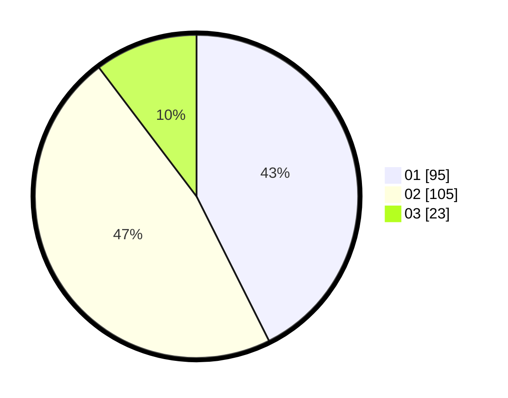

# Hasil

Hasil perolehan suara paslon dapat dilihat pada file paslon-01.txt, paslon-02.txt, dan paslon-03.txt.

Jika tidak ada, artinya data tersebut belum ada pada SIREKAP.

## Perolehan Suara

 * Paslon 01: **95**.
 * Paslon 02: **105**.
 * Paslon 03: **23**.

## Foto C Plano

https://sirekap-obj-formc.kpu.go.id/2d5d/pemilu/ppwp/31/75/01/10/06/3175011006032-20240215-013430--04d77326-90d2-4c66-93c8-e58b943d10dd.jpg

https://sirekap-obj-formc.kpu.go.id/2d5d/pemilu/ppwp/31/75/01/10/06/3175011006032-20240215-013545--bad9f734-cc32-47e1-8c79-5c1612d9bb15.jpg

https://sirekap-obj-formc.kpu.go.id/2d5d/pemilu/ppwp/31/75/01/10/06/3175011006032-20240215-013637--3e1a464b-a5d5-4a04-8800-1ebf3ab86d32.jpg
