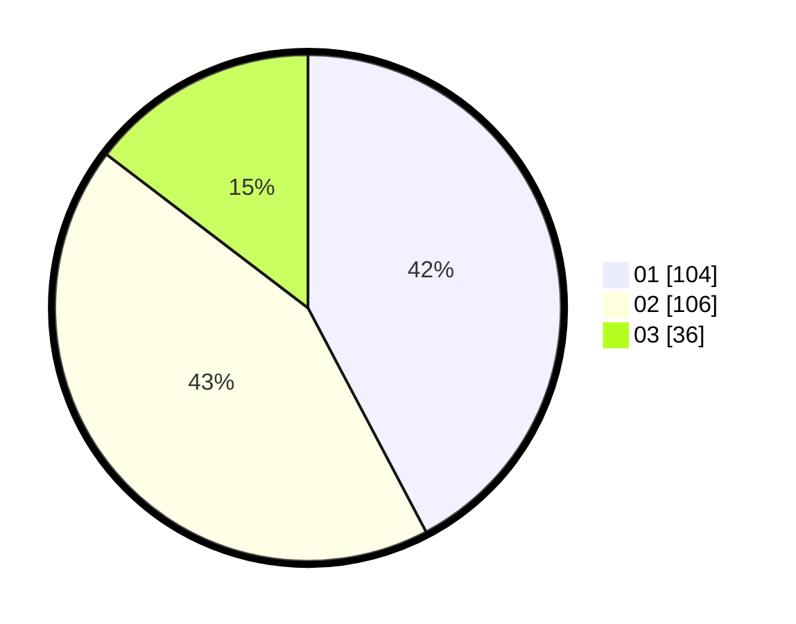

# Hasil

Hasil perolehan suara paslon dapat dilihat pada file paslon-01.txt, paslon-02.txt, dan paslon-03.txt.

Jika tidak ada, artinya data tersebut belum ada pada SIREKAP.

## Perolehan Suara

 * Paslon 01: **104**.
 * Paslon 02: **106**.
 * Paslon 03: **36**.

## Foto C Plano

https://sirekap-obj-formc.kpu.go.id/3797/pemilu/ppwp/31/75/01/10/06/3175011006033-20240214-212102--3c67aa4d-d3eb-4578-975f-f99ebff6c9c8.jpg

https://sirekap-obj-formc.kpu.go.id/3797/pemilu/ppwp/31/75/01/10/06/3175011006033-20240214-212115--3a7b6932-496a-456f-bd7b-7822200a0569.jpg

https://sirekap-obj-formc.kpu.go.id/3797/pemilu/ppwp/31/75/01/10/06/3175011006033-20240214-212125--100b96de-6589-4615-88bc-17e735e4194e.jpg
