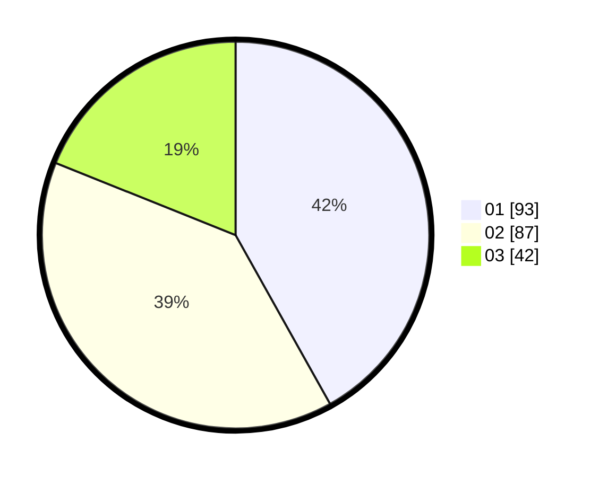

# Hasil

Hasil perolehan suara paslon dapat dilihat pada file paslon-01.txt, paslon-02.txt, dan paslon-03.txt.

Jika tidak ada, artinya data tersebut belum ada pada SIREKAP.

## Perolehan Suara

 * Paslon 01: **93**.
 * Paslon 02: **87**.
 * Paslon 03: **42**.

## Foto C Plano

https://sirekap-obj-formc.kpu.go.id/b813/pemilu/ppwp/31/75/01/10/06/3175011006036-20240215-013038--4ff8ec31-0f2c-406a-83b7-e1328d348f4a.jpg

https://sirekap-obj-formc.kpu.go.id/b813/pemilu/ppwp/31/75/01/10/06/3175011006036-20240215-013116--6335d0eb-ca28-49c8-b526-af7193862923.jpg

https://sirekap-obj-formc.kpu.go.id/b813/pemilu/ppwp/31/75/01/10/06/3175011006036-20240215-013210--3c559faa-b59d-41b7-ac58-5ab8a33e681e.jpg
