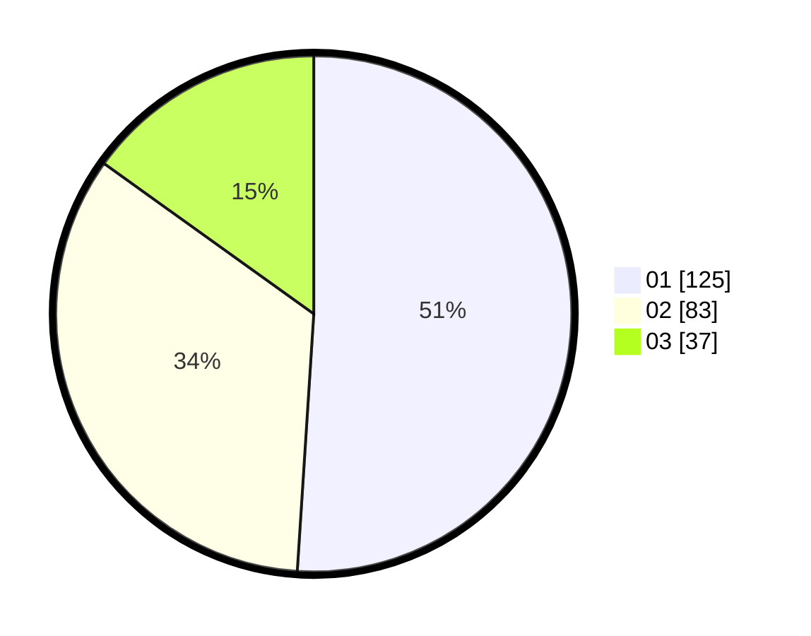

# Hasil

Hasil perolehan suara paslon dapat dilihat pada file paslon-01.txt, paslon-02.txt, dan paslon-03.txt.

Jika tidak ada, artinya data tersebut belum ada pada SIREKAP.

## Perolehan Suara

 * Paslon 01: **125**.
 * Paslon 02: **83**.
 * Paslon 03: **37**.

## Foto C Plano

https://sirekap-obj-formc.kpu.go.id/ae76/pemilu/ppwp/31/75/01/10/06/3175011006039-20240214-194821--662656d9-2a45-4ab5-afa1-91bc5a6180e2.jpg

https://sirekap-obj-formc.kpu.go.id/ae76/pemilu/ppwp/31/75/01/10/06/3175011006039-20240214-203015--dba065d9-768b-41ae-a655-a7b06c08243d.jpg

https://sirekap-obj-formc.kpu.go.id/ae76/pemilu/ppwp/31/75/01/10/06/3175011006039-20240214-203131--cf190bc1-e32e-43d1-b2dd-b0efe60a6db5.jpg

## DATA PEMILIH TETAP

Jumlah pemilih dalam DPT: **280**.
 * L: **136**.
 * P: **144**.

## DATA PENGGUNA HAK PILIH

Jumlah pengguna hak pilih dalam DPT: **234**.
 * L: **111**.
 * P: **123**.

Jumlah pengguna hak pilih dalam DPTb: **12**.
 * L: **5**.
 * P: **7**.

Jumlah pengguna hak pilih dalam DPK: **4**.
 * L: **1**.
 * P: **3**.

Jumlah pengguna hak pilih: **250**.
 * L: **117**.
 * P: **133**.

## JUMLAH SUARA SAH DAN TIDAK SAH

JUMLAH SELURUH SUARA SAH: **245**.

JUMLAH SUARA TIDAK SAH: **5**.

JUMLAH SELURUH SUARA SAH DAN SUARA TIDAK SAH: **250**.
