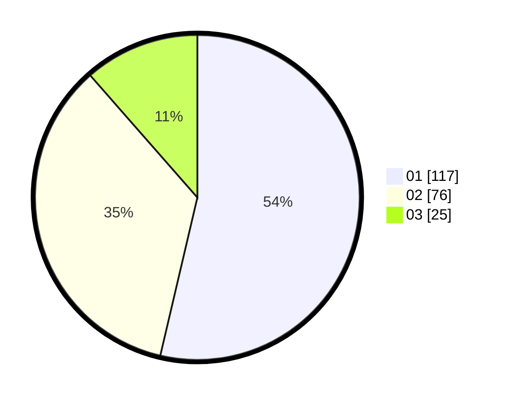

# Hasil

Hasil perolehan suara paslon dapat dilihat pada file paslon-01.txt, paslon-02.txt, dan paslon-03.txt.

Jika tidak ada, artinya data tersebut belum ada pada SIREKAP.

## Perolehan Suara

 * Paslon 01: **117**.
 * Paslon 02: **76**.
 * Paslon 03: **25**.

## Foto C Plano

https://sirekap-obj-formc.kpu.go.id/ab5a/pemilu/ppwp/31/75/01/10/06/3175011006040-20240215-030224--35a94ab0-9fd2-4248-b641-b0e84c32980f.jpg

https://sirekap-obj-formc.kpu.go.id/ab5a/pemilu/ppwp/31/75/01/10/06/3175011006040-20240215-025622--f4b50b18-eda9-406d-9682-13aadbf24681.jpg

https://sirekap-obj-formc.kpu.go.id/ab5a/pemilu/ppwp/31/75/01/10/06/3175011006040-20240215-025946--d2618ecc-dbf7-4e27-8cfc-c8b011a7f911.jpg
