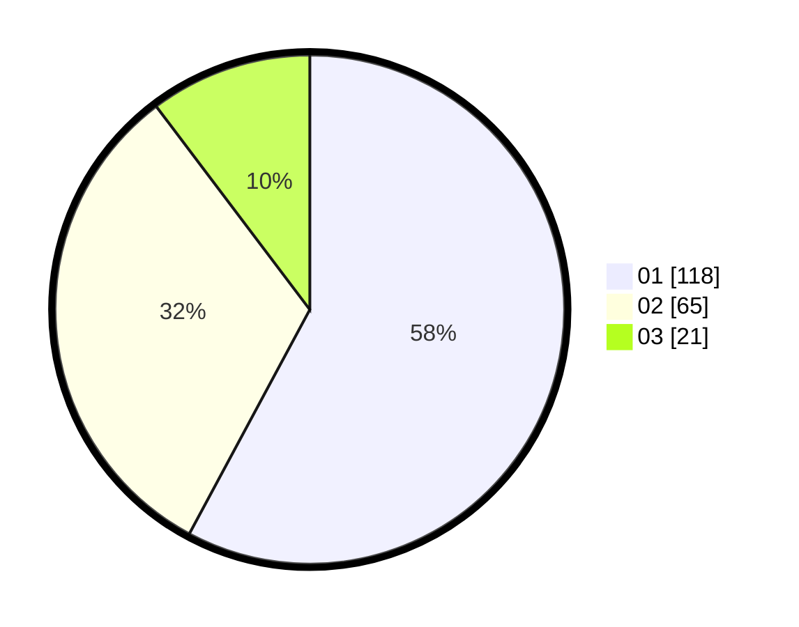

# Hasil

Hasil perolehan suara paslon dapat dilihat pada file paslon-01.txt, paslon-02.txt, dan paslon-03.txt.

Jika tidak ada, artinya data tersebut belum ada pada SIREKAP.

## Perolehan Suara

 * Paslon 01: **118**.
 * Paslon 02: **65**.
 * Paslon 03: **21**.

## Foto C Plano

https://sirekap-obj-formc.kpu.go.id/e54d/pemilu/ppwp/31/75/01/10/06/3175011006041-20240214-195512--10e50a70-a5ab-4cf9-a623-40a8bb450415.jpg

https://sirekap-obj-formc.kpu.go.id/e54d/pemilu/ppwp/31/75/01/10/06/3175011006041-20240214-220348--a948589d-08d8-45c0-9069-4d147bad974e.jpg

https://sirekap-obj-formc.kpu.go.id/e54d/pemilu/ppwp/31/75/01/10/06/3175011006041-20240214-192928--c35a062e-28e1-491b-83df-3f0bccb6d68b.jpg

## DATA PEMILIH TETAP

Jumlah pemilih dalam DPT: **277**.
 * L: **130**.
 * P: **147**.

## DATA PENGGUNA HAK PILIH

Jumlah pengguna hak pilih dalam DPT: **204**.
 * L: **94**.
 * P: **110**.

Jumlah pengguna hak pilih dalam DPTb: **2**.
 * L: **0**.
 * P: **2**.

Jumlah pengguna hak pilih dalam DPK: **0**.
 * L: **0**.
 * P: **0**.

Jumlah pengguna hak pilih: **206**.
 * L: **94**.
 * P: **112**.

## JUMLAH SUARA SAH DAN TIDAK SAH

JUMLAH SELURUH SUARA SAH: **204**.

JUMLAH SUARA TIDAK SAH: **2**.

JUMLAH SELURUH SUARA SAH DAN SUARA TIDAK SAH: **206**.
