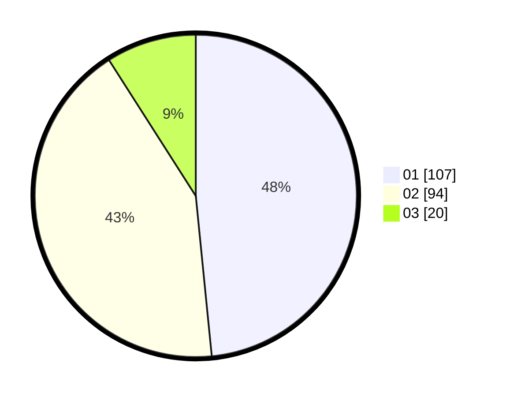

# Hasil

Hasil perolehan suara paslon dapat dilihat pada file paslon-01.txt, paslon-02.txt, dan paslon-03.txt.

Jika tidak ada, artinya data tersebut belum ada pada SIREKAP.

## Perolehan Suara

 * Paslon 01: **107**.
 * Paslon 02: **94**.
 * Paslon 03: **20**.

## Foto C Plano

https://sirekap-obj-formc.kpu.go.id/b9c5/pemilu/ppwp/31/75/01/10/06/3175011006045-20240214-200228--f4112050-3955-439a-8f59-4167dd984670.jpg

https://sirekap-obj-formc.kpu.go.id/b9c5/pemilu/ppwp/31/75/01/10/06/3175011006045-20240214-200138--578d8f72-866f-4251-b2b5-463293a08b9c.jpg

https://sirekap-obj-formc.kpu.go.id/b9c5/pemilu/ppwp/31/75/01/10/06/3175011006045-20240214-205131--387b8529-cdc9-4b94-8198-64334dfc80bc.jpg

## DATA PEMILIH TETAP

Jumlah pemilih dalam DPT: **277**.
 * L: **137**.
 * P: **140**.

## DATA PENGGUNA HAK PILIH

Jumlah pengguna hak pilih dalam DPT: **219**.
 * L: **122**.
 * P: **97**.

Jumlah pengguna hak pilih dalam DPTb: **1**.
 * L: **0**.
 * P: **1**.

Jumlah pengguna hak pilih dalam DPK: **4**.
 * L: **4**.
 * P: **0**.

Jumlah pengguna hak pilih: **224**.
 * L: **126**.
 * P: **98**.

## JUMLAH SUARA SAH DAN TIDAK SAH

JUMLAH SELURUH SUARA SAH: **221**.

JUMLAH SUARA TIDAK SAH: **3**.

JUMLAH SELURUH SUARA SAH DAN SUARA TIDAK SAH: **224**.
