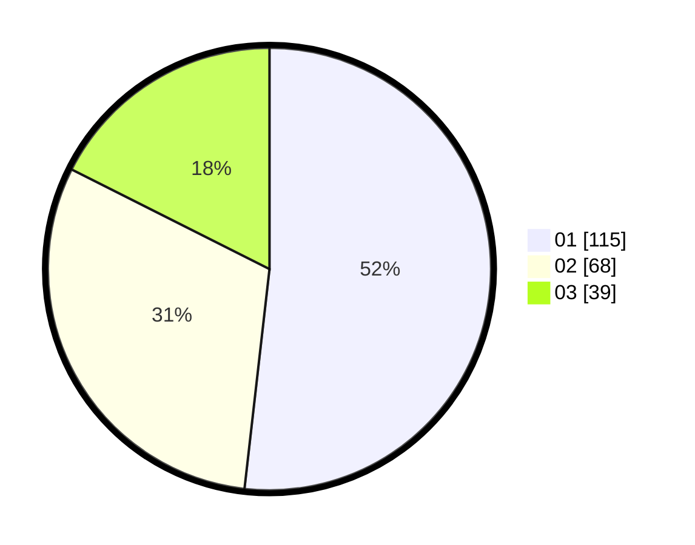

# Hasil

Hasil perolehan suara paslon dapat dilihat pada file paslon-01.txt, paslon-02.txt, dan paslon-03.txt.

Jika tidak ada, artinya data tersebut belum ada pada SIREKAP.

## Perolehan Suara

 * Paslon 01: **115**.
 * Paslon 02: **68**.
 * Paslon 03: **39**.

## Foto C Plano

https://sirekap-obj-formc.kpu.go.id/f950/pemilu/ppwp/31/75/01/10/06/3175011006049-20240215-234917--ac9471cc-9a3a-4f1c-91b0-4ae1e601bdf3.jpg

https://sirekap-obj-formc.kpu.go.id/f950/pemilu/ppwp/31/75/01/10/06/3175011006049-20240215-234919--dc444d6b-2157-44f3-888d-1d9cbcb00c12.jpg

https://sirekap-obj-formc.kpu.go.id/f950/pemilu/ppwp/31/75/01/10/06/3175011006049-20240215-234918--2c433018-8d15-4c96-bf75-87a478d0ec30.jpg

## DATA PEMILIH TETAP

Jumlah pemilih dalam DPT: **278**.
 * L: **133**.
 * P: **145**.

## DATA PENGGUNA HAK PILIH

Jumlah pengguna hak pilih dalam DPT: **218**.
 * L: **102**.
 * P: **116**.

Jumlah pengguna hak pilih dalam DPTb: **6**.
 * L: **3**.
 * P: **3**.

Jumlah pengguna hak pilih dalam DPK: **0**.
 * L: **0**.
 * P: **0**.

Jumlah pengguna hak pilih: **224**.
 * L: **105**.
 * P: **119**.

## JUMLAH SUARA SAH DAN TIDAK SAH

JUMLAH SELURUH SUARA SAH: **222**.

JUMLAH SUARA TIDAK SAH: **2**.

JUMLAH SELURUH SUARA SAH DAN SUARA TIDAK SAH: **224**.
