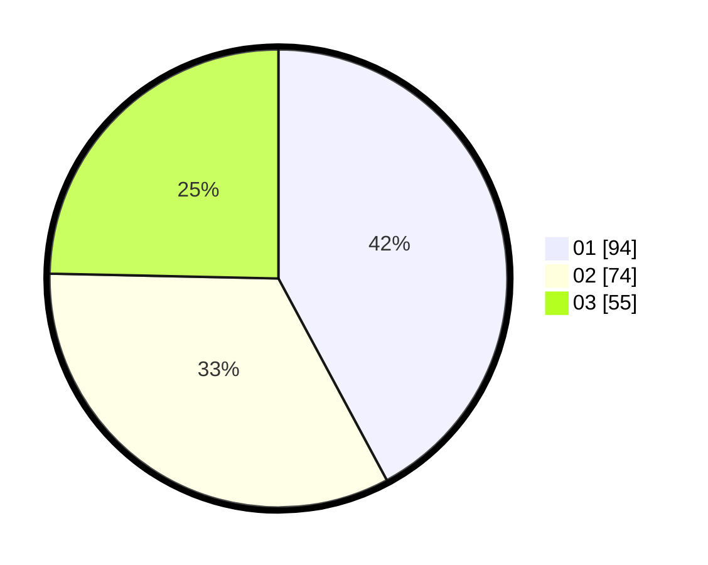

# Hasil

Hasil perolehan suara paslon dapat dilihat pada file paslon-01.txt, paslon-02.txt, dan paslon-03.txt.

Jika tidak ada, artinya data tersebut belum ada pada SIREKAP.

## Perolehan Suara

 * Paslon 01: **94**.
 * Paslon 02: **74**.
 * Paslon 03: **55**.

## Foto C Plano

https://sirekap-obj-formc.kpu.go.id/e76a/pemilu/ppwp/31/75/01/10/06/3175011006050-20240216-050211--64bf434c-f0f0-4923-bbfd-2792ae854ea7.jpg

https://sirekap-obj-formc.kpu.go.id/e76a/pemilu/ppwp/31/75/01/10/06/3175011006050-20240216-045019--b98ed9d3-cc0d-409b-806a-48866122c0a7.jpg

https://sirekap-obj-formc.kpu.go.id/e76a/pemilu/ppwp/31/75/01/10/06/3175011006050-20240216-045009--eb493d3c-1914-447b-8869-8ea4dfcbb11f.jpg

## DATA PEMILIH TETAP

Jumlah pemilih dalam DPT: **279**.
 * L: **133**.
 * P: **146**.

## DATA PENGGUNA HAK PILIH

Jumlah pengguna hak pilih dalam DPT: **224**.
 * L: **100**.
 * P: **124**.

Jumlah pengguna hak pilih dalam DPTb: **5**.
 * L: **3**.
 * P: **2**.

Jumlah pengguna hak pilih dalam DPK: **0**.
 * L: **0**.
 * P: **0**.

Jumlah pengguna hak pilih: **229**.
 * L: **103**.
 * P: **126**.

## JUMLAH SUARA SAH DAN TIDAK SAH

JUMLAH SELURUH SUARA SAH: **223**.

JUMLAH SUARA TIDAK SAH: **6**.

JUMLAH SELURUH SUARA SAH DAN SUARA TIDAK SAH: **229**.
