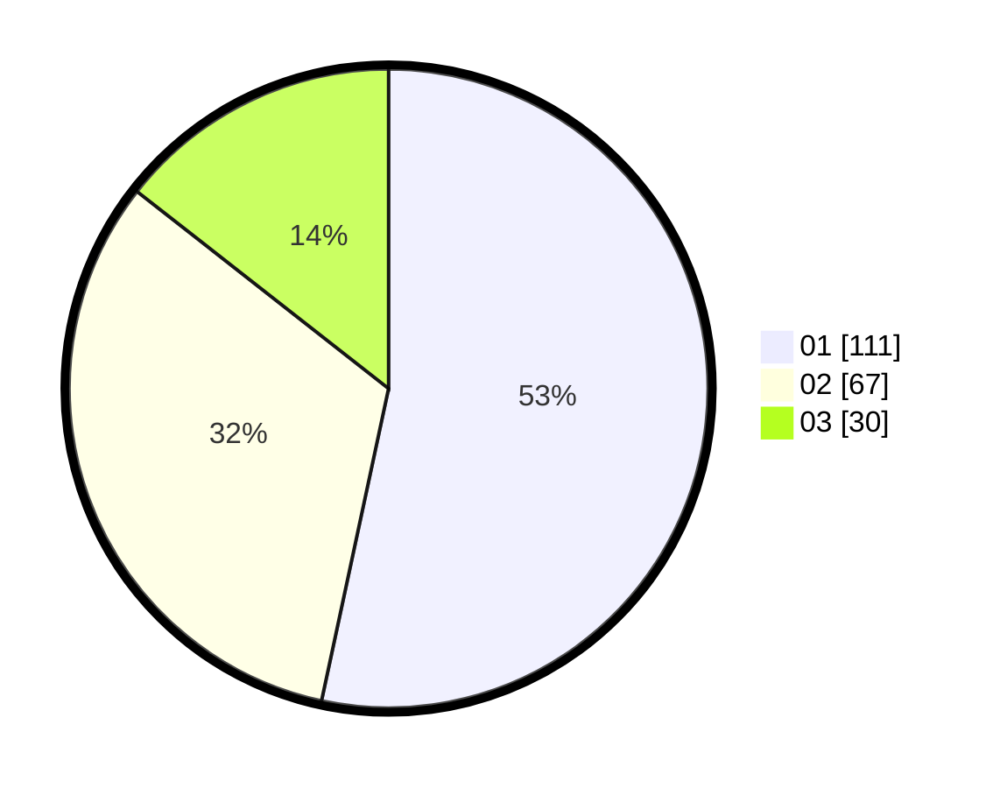

# Hasil

Hasil perolehan suara paslon dapat dilihat pada file paslon-01.txt, paslon-02.txt, dan paslon-03.txt.

Jika tidak ada, artinya data tersebut belum ada pada SIREKAP.

## Perolehan Suara

 * Paslon 01: **111**.
 * Paslon 02: **67**.
 * Paslon 03: **30**.

## Foto C Plano

https://sirekap-obj-formc.kpu.go.id/a5ae/pemilu/ppwp/31/75/01/10/06/3175011006051-20240214-222101--9d9b6d87-570c-44c2-961c-38c4f7fade8f.jpg

https://sirekap-obj-formc.kpu.go.id/a5ae/pemilu/ppwp/31/75/01/10/06/3175011006051-20240214-222251--027389c2-e278-460c-99a1-274761902870.jpg

https://sirekap-obj-formc.kpu.go.id/a5ae/pemilu/ppwp/31/75/01/10/06/3175011006051-20240214-222502--24b52406-dbe6-4182-8078-e35608373aeb.jpg
