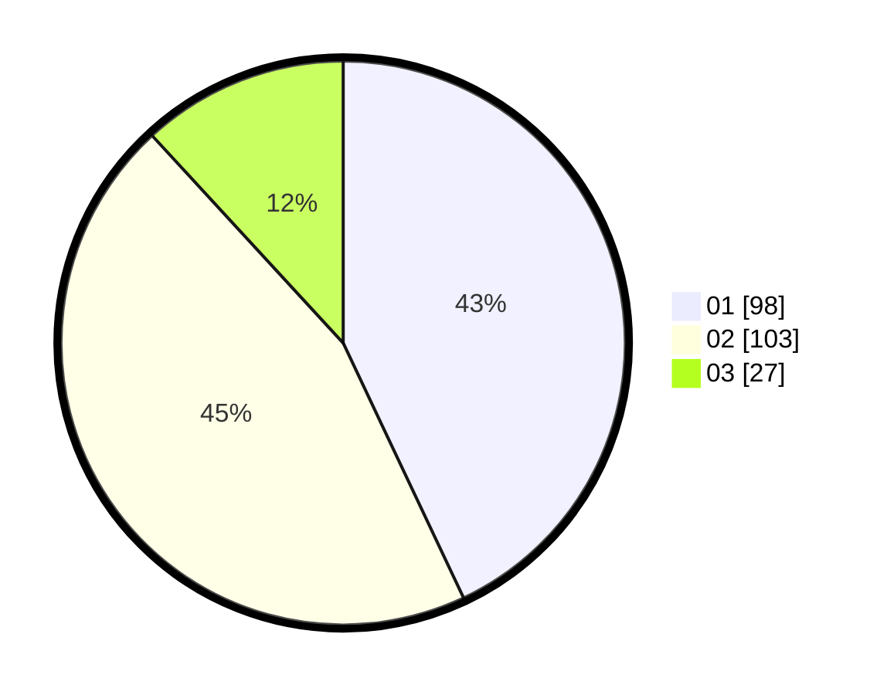

# Hasil

Hasil perolehan suara paslon dapat dilihat pada file paslon-01.txt, paslon-02.txt, dan paslon-03.txt.

Jika tidak ada, artinya data tersebut belum ada pada SIREKAP.

## Perolehan Suara

 * Paslon 01: **98**.
 * Paslon 02: **103**.
 * Paslon 03: **27**.

## Foto C Plano

https://sirekap-obj-formc.kpu.go.id/df25/pemilu/ppwp/31/75/01/10/06/3175011006053-20240214-155705--460d1ff0-58d7-4f52-b064-58c5080d27f5.jpg

https://sirekap-obj-formc.kpu.go.id/df25/pemilu/ppwp/31/75/01/10/06/3175011006053-20240214-155505--a8943bb9-5418-43ef-9c54-4b5cc267cb82.jpg

https://sirekap-obj-formc.kpu.go.id/df25/pemilu/ppwp/31/75/01/10/06/3175011006053-20240214-155611--d66a7511-0b9a-4562-a9ed-ab922811905b.jpg

## DATA PEMILIH TETAP

Jumlah pemilih dalam DPT: **281**.
 * L: **146**.
 * P: **135**.

## DATA PENGGUNA HAK PILIH

Jumlah pengguna hak pilih dalam DPT: **228**.
 * L: **115**.
 * P: **113**.

Jumlah pengguna hak pilih dalam DPTb: **0**.
 * L: **0**.
 * P: **0**.

Jumlah pengguna hak pilih dalam DPK: **2**.
 * L: **1**.
 * P: **1**.

Jumlah pengguna hak pilih: **230**.
 * L: **116**.
 * P: **114**.

## JUMLAH SUARA SAH DAN TIDAK SAH

JUMLAH SELURUH SUARA SAH: **228**.

JUMLAH SUARA TIDAK SAH: **2**.

JUMLAH SELURUH SUARA SAH DAN SUARA TIDAK SAH: **230**.
