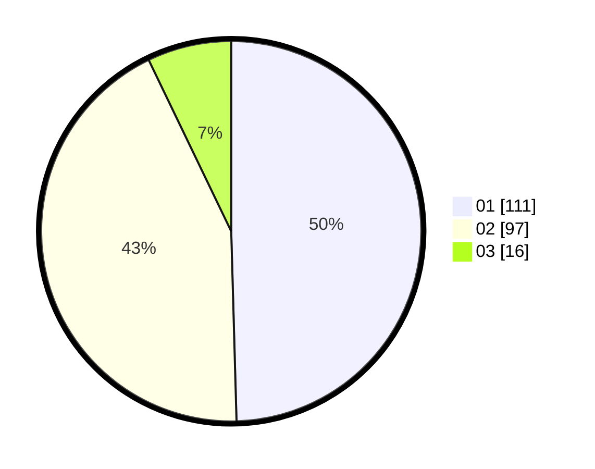

# Hasil

Hasil perolehan suara paslon dapat dilihat pada file paslon-01.txt, paslon-02.txt, dan paslon-03.txt.

Jika tidak ada, artinya data tersebut belum ada pada SIREKAP.

## Perolehan Suara

 * Paslon 01: **111**.
 * Paslon 02: **97**.
 * Paslon 03: **16**.

## Foto C Plano

https://sirekap-obj-formc.kpu.go.id/7d11/pemilu/ppwp/31/75/01/10/06/3175011006054-20240215-024011--b3fd4383-aef0-41a6-b915-d543f9b75555.jpg

https://sirekap-obj-formc.kpu.go.id/7d11/pemilu/ppwp/31/75/01/10/06/3175011006054-20240215-024059--397c8625-d162-4d76-b42e-771526e18dfc.jpg

https://sirekap-obj-formc.kpu.go.id/7d11/pemilu/ppwp/31/75/01/10/06/3175011006054-20240215-024148--51f4337f-8014-4eb7-a521-231b64e142d7.jpg
