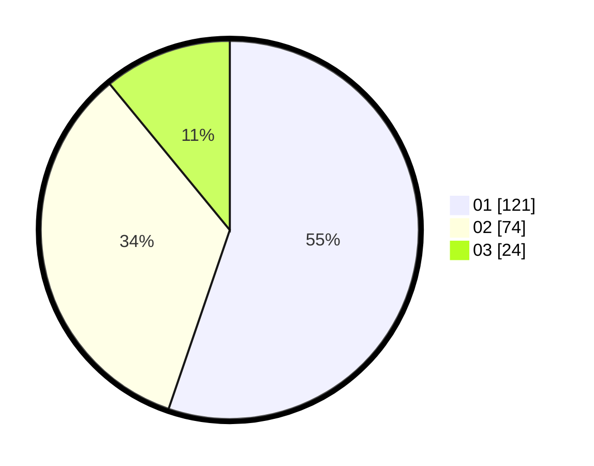

# Hasil

Hasil perolehan suara paslon dapat dilihat pada file paslon-01.txt, paslon-02.txt, dan paslon-03.txt.

Jika tidak ada, artinya data tersebut belum ada pada SIREKAP.

## Perolehan Suara

 * Paslon 01: **121**.
 * Paslon 02: **74**.
 * Paslon 03: **24**.

## Foto C Plano

https://sirekap-obj-formc.kpu.go.id/9c7b/pemilu/ppwp/31/75/01/10/06/3175011006056-20240215-024046--e13e9b9d-07fc-407f-bb65-9268784c86fa.jpg

https://sirekap-obj-formc.kpu.go.id/9c7b/pemilu/ppwp/31/75/01/10/06/3175011006056-20240215-024209--f38fef88-e195-4bf1-8f25-5fcf409359d6.jpg

https://sirekap-obj-formc.kpu.go.id/9c7b/pemilu/ppwp/31/75/01/10/06/3175011006056-20240215-024312--f41cb9a1-bbb9-4504-8899-65d7e7d8d747.jpg
