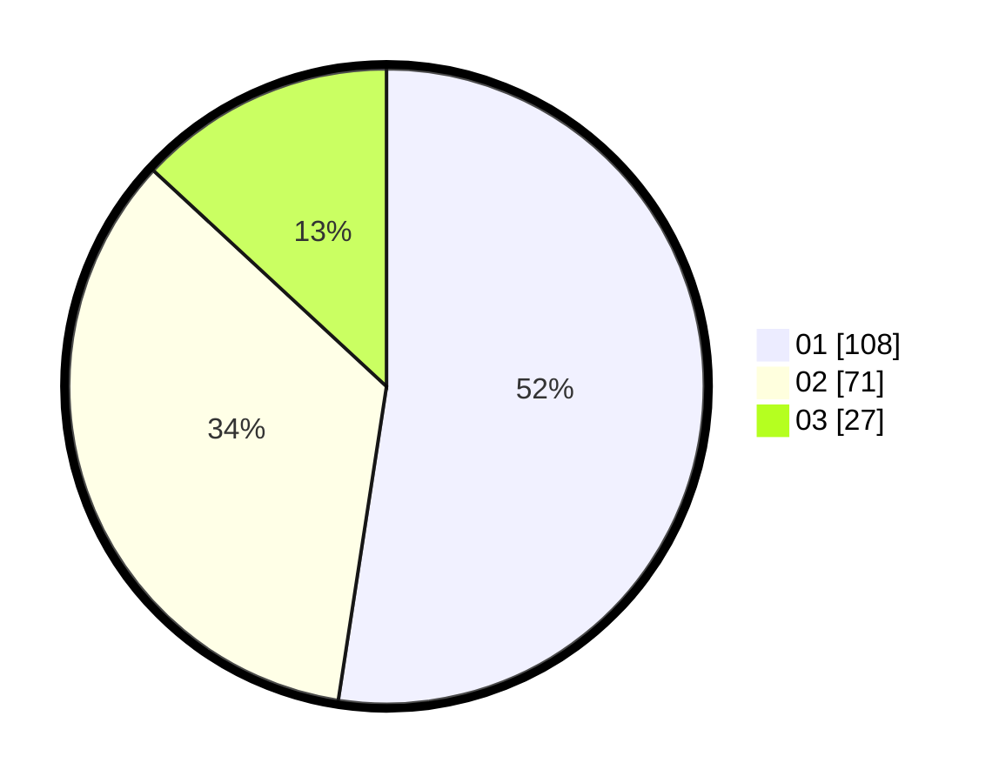

# Hasil

Hasil perolehan suara paslon dapat dilihat pada file paslon-01.txt, paslon-02.txt, dan paslon-03.txt.

Jika tidak ada, artinya data tersebut belum ada pada SIREKAP.

## Perolehan Suara

 * Paslon 01: **108**.
 * Paslon 02: **71**.
 * Paslon 03: **27**.

## Foto C Plano

https://sirekap-obj-formc.kpu.go.id/ad70/pemilu/ppwp/31/75/01/10/06/3175011006057-20240216-151542--0480042c-2f3d-4ca3-901f-61edbd504964.jpg

https://sirekap-obj-formc.kpu.go.id/ad70/pemilu/ppwp/31/75/01/10/06/3175011006057-20240216-111434--015fd7af-93d7-48c2-b113-fd0c166b20b0.jpg

https://sirekap-obj-formc.kpu.go.id/ad70/pemilu/ppwp/31/75/01/10/06/3175011006057-20240216-111426--a9fda331-af0c-4ab9-86f5-4c6aea2f3331.jpg

## DATA PEMILIH TETAP

Jumlah pemilih dalam DPT: **274**.
 * L: **128**.
 * P: **146**.

## DATA PENGGUNA HAK PILIH

Jumlah pengguna hak pilih dalam DPT: **206**.
 * L: **84**.
 * P: **122**.

Jumlah pengguna hak pilih dalam DPTb: **4**.
 * L: **2**.
 * P: **2**.

Jumlah pengguna hak pilih dalam DPK: **0**.
 * L: **0**.
 * P: **0**.

Jumlah pengguna hak pilih: **210**.
 * L: **86**.
 * P: **124**.

## JUMLAH SUARA SAH DAN TIDAK SAH

JUMLAH SELURUH SUARA SAH: **206**.

JUMLAH SUARA TIDAK SAH: **4**.

JUMLAH SELURUH SUARA SAH DAN SUARA TIDAK SAH: **210**.
