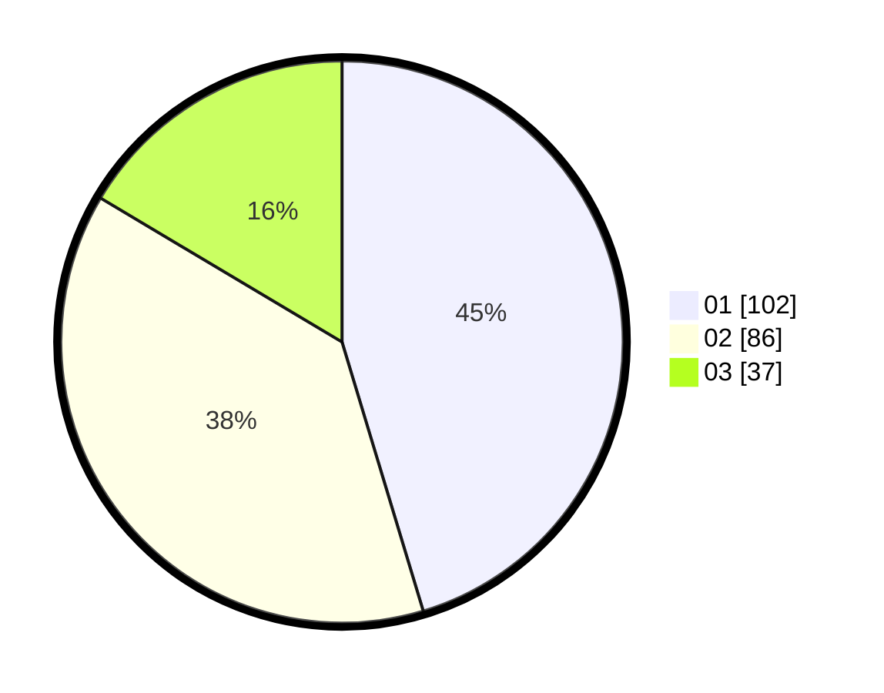

# Hasil

Hasil perolehan suara paslon dapat dilihat pada file paslon-01.txt, paslon-02.txt, dan paslon-03.txt.

Jika tidak ada, artinya data tersebut belum ada pada SIREKAP.

## Perolehan Suara

 * Paslon 01: **102**.
 * Paslon 02: **86**.
 * Paslon 03: **37**.

## Foto C Plano

https://sirekap-obj-formc.kpu.go.id/8299/pemilu/ppwp/31/75/01/10/06/3175011006062-20240215-004119--e8e9bce0-b040-4abe-9ceb-5ef4a76fbef7.jpg

https://sirekap-obj-formc.kpu.go.id/8299/pemilu/ppwp/31/75/01/10/06/3175011006062-20240215-004205--540c8662-b42a-46e9-ad4d-6a3cb193f0ee.jpg

https://sirekap-obj-formc.kpu.go.id/8299/pemilu/ppwp/31/75/01/10/06/3175011006062-20240215-004250--c6e3eb1c-ea2e-4f3c-9a72-74ec3b316172.jpg
