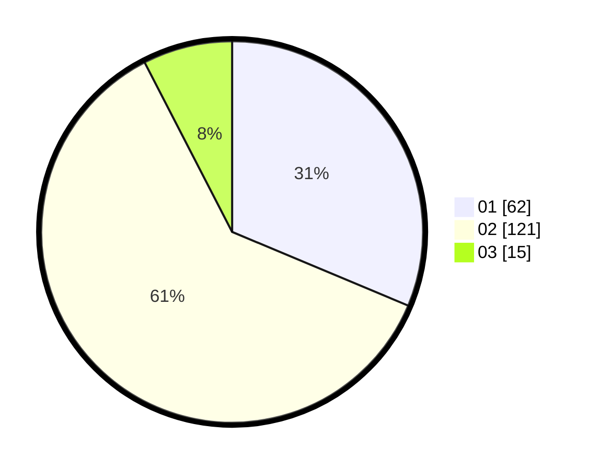

# Hasil

Hasil perolehan suara paslon dapat dilihat pada file paslon-01.txt, paslon-02.txt, dan paslon-03.txt.

Jika tidak ada, artinya data tersebut belum ada pada SIREKAP.

## Perolehan Suara

 * Paslon 01: **62**.
 * Paslon 02: **121**.
 * Paslon 03: **15**.

## Foto C Plano

https://sirekap-obj-formc.kpu.go.id/7112/pemilu/ppwp/31/75/01/10/06/3175011006063-20240214-190602--6f41940f-8243-4bdc-8926-2343e15ed548.jpg

https://sirekap-obj-formc.kpu.go.id/7112/pemilu/ppwp/31/75/01/10/06/3175011006063-20240214-190719--e8cdb5d3-52c5-4a96-8d10-f60386ad5521.jpg

https://sirekap-obj-formc.kpu.go.id/7112/pemilu/ppwp/31/75/01/10/06/3175011006063-20240214-203237--00754f62-7f29-4d41-916c-a848b438772f.jpg

## DATA PEMILIH TETAP

Jumlah pemilih dalam DPT: **261**.
 * L: **122**.
 * P: **139**.

## DATA PENGGUNA HAK PILIH

Jumlah pengguna hak pilih dalam DPT: **197**.
 * L: **87**.
 * P: **110**.

Jumlah pengguna hak pilih dalam DPTb: **8**.
 * L: **5**.
 * P: **3**.

Jumlah pengguna hak pilih dalam DPK: **0**.
 * L: **0**.
 * P: **0**.

Jumlah pengguna hak pilih: **205**.
 * L: **92**.
 * P: **113**.

## JUMLAH SUARA SAH DAN TIDAK SAH

JUMLAH SELURUH SUARA SAH: **198**.

JUMLAH SUARA TIDAK SAH: **7**.

JUMLAH SELURUH SUARA SAH DAN SUARA TIDAK SAH: **205**.
