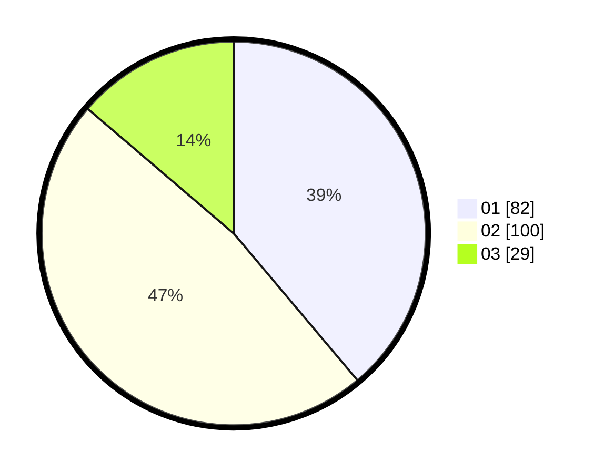

# Hasil

Hasil perolehan suara paslon dapat dilihat pada file paslon-01.txt, paslon-02.txt, dan paslon-03.txt.

Jika tidak ada, artinya data tersebut belum ada pada SIREKAP.

## Perolehan Suara

 * Paslon 01: **82**.
 * Paslon 02: **100**.
 * Paslon 03: **29**.

## Foto C Plano

https://sirekap-obj-formc.kpu.go.id/cb98/pemilu/ppwp/31/75/01/10/06/3175011006064-20240215-000727--8d5869e7-e776-47f6-8c77-7c310403f90b.jpg

https://sirekap-obj-formc.kpu.go.id/cb98/pemilu/ppwp/31/75/01/10/06/3175011006064-20240215-000800--32baa1bc-a444-478b-85dc-41c1b09b636e.jpg

https://sirekap-obj-formc.kpu.go.id/cb98/pemilu/ppwp/31/75/01/10/06/3175011006064-20240215-000921--09e89e16-07fa-45c4-ae1b-617f5f0a33a7.jpg
