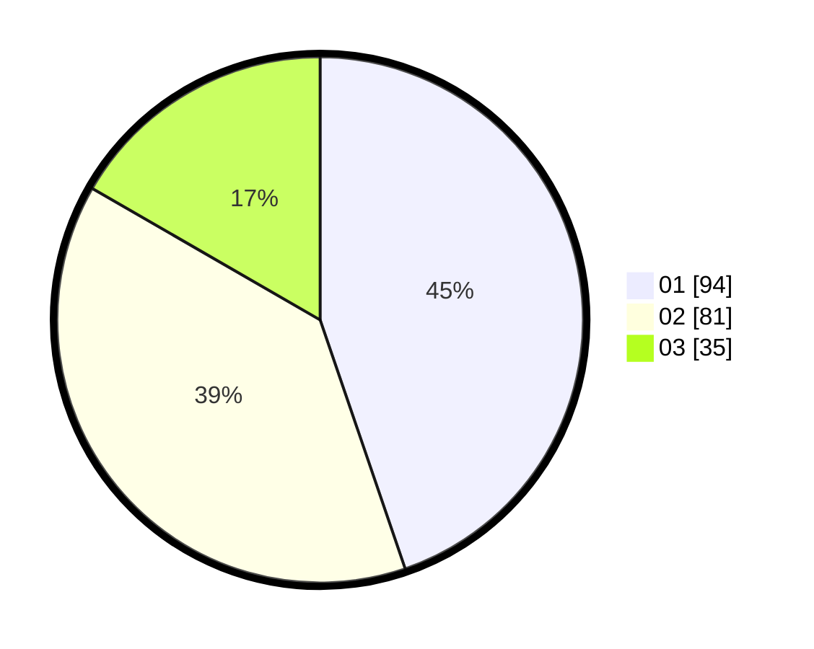

# Hasil

Hasil perolehan suara paslon dapat dilihat pada file paslon-01.txt, paslon-02.txt, dan paslon-03.txt.

Jika tidak ada, artinya data tersebut belum ada pada SIREKAP.

## Perolehan Suara

 * Paslon 01: **94**.
 * Paslon 02: **81**.
 * Paslon 03: **35**.

## Foto C Plano

https://sirekap-obj-formc.kpu.go.id/4014/pemilu/ppwp/31/75/01/10/06/3175011006065-20240214-192004--c3b257d8-eed0-484f-9142-32ee71436be2.jpg

https://sirekap-obj-formc.kpu.go.id/4014/pemilu/ppwp/31/75/01/10/06/3175011006065-20240214-191429--1373c4bb-68f7-4e69-941c-03a41211e0f0.jpg

https://sirekap-obj-formc.kpu.go.id/4014/pemilu/ppwp/31/75/01/10/06/3175011006065-20240214-200930--375afffe-fcb4-47f9-8228-da8078e6f2c8.jpg

## DATA PEMILIH TETAP

Jumlah pemilih dalam DPT: **263**.
 * L: **131**.
 * P: **132**.

## DATA PENGGUNA HAK PILIH

Jumlah pengguna hak pilih dalam DPT: **206**.
 * L: **95**.
 * P: **111**.

Jumlah pengguna hak pilih dalam DPTb: **3**.
 * L: **2**.
 * P: **1**.

Jumlah pengguna hak pilih dalam DPK: **2**.
 * L: **0**.
 * P: **2**.

Jumlah pengguna hak pilih: **211**.
 * L: **97**.
 * P: **114**.

## JUMLAH SUARA SAH DAN TIDAK SAH

JUMLAH SELURUH SUARA SAH: **210**.

JUMLAH SUARA TIDAK SAH: **1**.

JUMLAH SELURUH SUARA SAH DAN SUARA TIDAK SAH: **211**.
