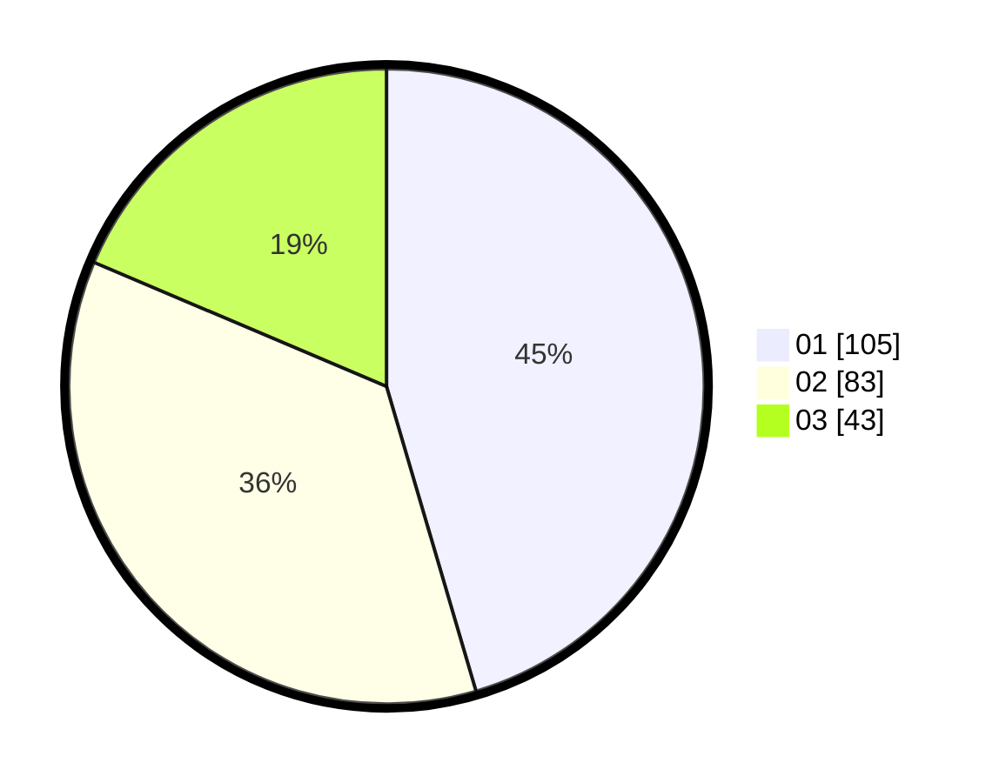

# Hasil

Hasil perolehan suara paslon dapat dilihat pada file paslon-01.txt, paslon-02.txt, dan paslon-03.txt.

Jika tidak ada, artinya data tersebut belum ada pada SIREKAP.

## Perolehan Suara

 * Paslon 01: **105**.
 * Paslon 02: **83**.
 * Paslon 03: **43**.

## Foto C Plano

https://sirekap-obj-formc.kpu.go.id/74fb/pemilu/ppwp/31/75/01/10/06/3175011006069-20240215-022649--ee775619-3ac1-4340-b160-d9d35462ed6f.jpg

https://sirekap-obj-formc.kpu.go.id/74fb/pemilu/ppwp/31/75/01/10/06/3175011006069-20240215-022907--2f340f85-b5fe-469b-9395-873f8d3d2b2f.jpg

https://sirekap-obj-formc.kpu.go.id/74fb/pemilu/ppwp/31/75/01/10/06/3175011006069-20240215-023118--84fb74c8-3574-42e5-9dbd-9ffc0ad98862.jpg
