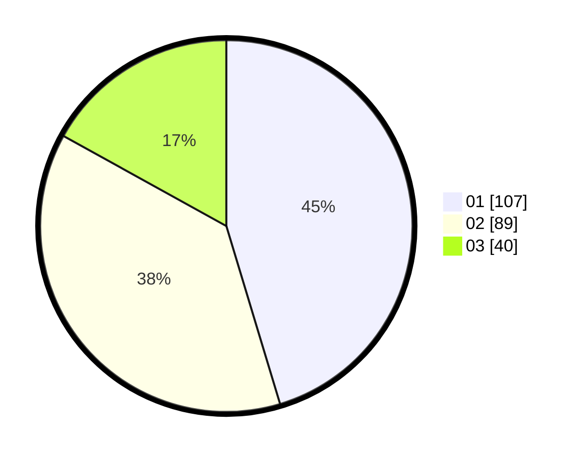

# Hasil

Hasil perolehan suara paslon dapat dilihat pada file paslon-01.txt, paslon-02.txt, dan paslon-03.txt.

Jika tidak ada, artinya data tersebut belum ada pada SIREKAP.

## Perolehan Suara

 * Paslon 01: **107**.
 * Paslon 02: **89**.
 * Paslon 03: **40**.

## Foto C Plano

https://sirekap-obj-formc.kpu.go.id/7e4f/pemilu/ppwp/31/75/01/10/06/3175011006072-20240214-201553--12317f64-e167-4125-9f25-71f7079c7f70.jpg

https://sirekap-obj-formc.kpu.go.id/7e4f/pemilu/ppwp/31/75/01/10/06/3175011006072-20240214-201612--0ac89468-b015-4afe-9084-67fdc0fcf263.jpg

https://sirekap-obj-formc.kpu.go.id/7e4f/pemilu/ppwp/31/75/01/10/06/3175011006072-20240214-201631--22eaccab-dbb4-44a7-9fe3-23ceda141ff3.jpg

## DATA PEMILIH TETAP

Jumlah pemilih dalam DPT: **272**.
 * L: **134**.
 * P: **138**.

## DATA PENGGUNA HAK PILIH

Jumlah pengguna hak pilih dalam DPT: **234**.
 * L: **111**.
 * P: **123**.

Jumlah pengguna hak pilih dalam DPTb: **1**.
 * L: **0**.
 * P: **1**.

Jumlah pengguna hak pilih dalam DPK: **1**.
 * L: **0**.
 * P: **1**.

Jumlah pengguna hak pilih: **236**.
 * L: **111**.
 * P: **125**.

## JUMLAH SUARA SAH DAN TIDAK SAH

JUMLAH SELURUH SUARA SAH: **236**.

JUMLAH SUARA TIDAK SAH: **0**.

JUMLAH SELURUH SUARA SAH DAN SUARA TIDAK SAH: **236**.
