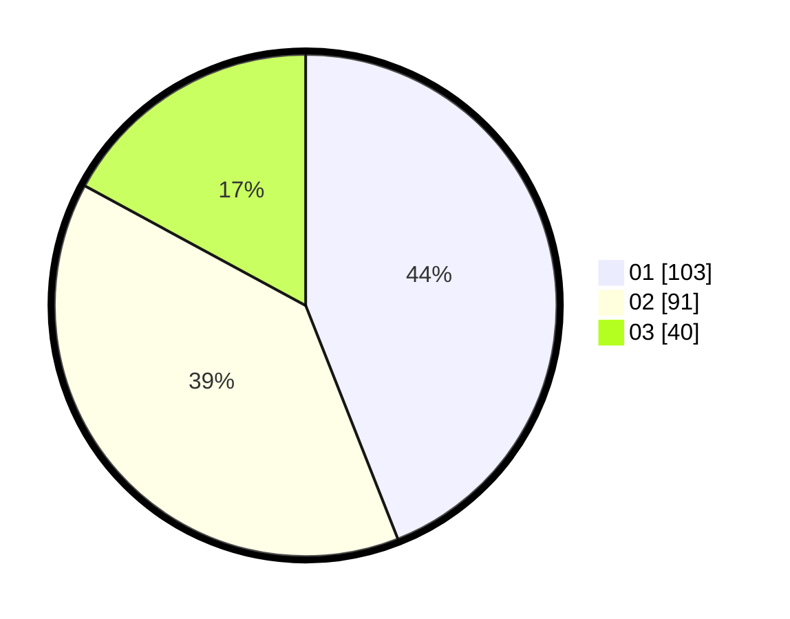

# Hasil

Hasil perolehan suara paslon dapat dilihat pada file paslon-01.txt, paslon-02.txt, dan paslon-03.txt.

Jika tidak ada, artinya data tersebut belum ada pada SIREKAP.

## Perolehan Suara

 * Paslon 01: **103**.
 * Paslon 02: **91**.
 * Paslon 03: **40**.

## Foto C Plano

https://sirekap-obj-formc.kpu.go.id/19ff/pemilu/ppwp/31/75/01/10/06/3175011006073-20240214-214006--9dc1a757-5f62-4bad-9d45-0a65f54ec0d5.jpg

https://sirekap-obj-formc.kpu.go.id/19ff/pemilu/ppwp/31/75/01/10/06/3175011006073-20240214-224059--e18c2b86-f67e-4901-9ab4-a5a9780e0b7d.jpg

https://sirekap-obj-formc.kpu.go.id/19ff/pemilu/ppwp/31/75/01/10/06/3175011006073-20240214-214225--032359ab-f364-4c4c-8897-973b3e0c9ff8.jpg
